# HakuRiver - 共享容器叢集與 VPS 任務

[](./README.md)
[](./README.zh.md)

[](https://opensource.org/licenses/Apache-2.0)


**HakuRiver** 是一個輕量級、自託管的叢集管理系統，專為在計算節點間分配命令列任務和啟動持久性互動式工作階段（稱為 **VPS 任務**）而設計。它主要利用 **Docker** 來管理可重現的任務環境，讓使用者能將容器視為便攜式「虛擬環境」。HakuRiver 協調這些容器化環境的建立、打包（透過 tarball）、分發和在節點間的執行。

它提供資源分配（CPU/記憶體/GPU 限制）、多節點/NUMA/GPU 任務提交和狀態追蹤功能，非常適合研究實驗室、中小型團隊、家庭實驗室或開發環境，這些環境需要簡單、可重現的分散式任務執行和隨需互動式計算環境，而不需承擔複雜 HPC 排程器的額外負擔。

## HakuRiver 簡介

### 問題背景

研究人員和小型團隊在使用少量計算節點（通常 3-8 台機器）時，經常面臨尷尬的中間地帶：

- **機器太多**，無法有效地透過 SSH 和 Shell 腳本手動管理
- **機器太少**，難以接受部署複雜 HPC 排程器（如 Slurm）的額外開銷
- **容器編排系統**（如 Kubernetes）對於簡單的任務分發或單一、長時間執行的互動式工作階段而言**過於複雜**

您擁有這些強大的計算資源，卻沒有高效方法在不增加大量運維開銷的情況下，將它們作為統一的計算資源使用。

### 核心概念：將節點視為一台大型電腦

HakuRiver 透過以下關鍵設計原則，讓您將小型叢集視為單一強大電腦：

- **輕量級資源管理**：以最少的設置在節點間分發命令列任務和互動式 VPS 工作階段
- **環境一致性**：使用 Docker 容器作為可攜式虛擬環境，而非複雜的應用程式部署
- **無縫同步**：自動將容器環境分發到執行節點，無需在每個節點上手動設置
- **熟悉的工作流程**：透過簡單的介面提交任務，就像在本機執行命令或啟動環境一樣

> HakuRiver 中的 Docker 作為一種可動態調整和自動同步的虛擬環境。您可以使用相同的容器環境執行數十個任務或啟動多個互動式工作階段，但在完全不同的節點上執行它們。

### 運作原理

1. **環境管理**：使用 `hakuriver.docker` 命令和互動式 shell（`hakuriver.docker-shell`）在主機節點上建立和自訂 Docker 容器。
2. **打包與分發**：使用 `hakuriver.docker create-tar` 將環境打包為 tarball 並存儲在共享儲存中。
3. **自動同步**：執行節點在執行任務前自動從共享儲存獲取所需環境。
4. **平行/互動式執行**：提交單一命令、批次平行任務或啟動持久性 VPS 任務在多個節點上執行，每個任務在自己的容器實例中隔離（或透過 systemd 直接執行命令任務）。

這種方法符合以下理念：

> 對於小型本地叢集，應優先選擇「輕量、簡單、恰好足夠」的解決方案。您不需要將每個命令打包成複雜的 Dockerfile - Docker 在這裡的目的是環境管理和同步。

HakuRiver 建立在小型本地叢集的實際假設基礎上：

- 節點可以輕易建立網路通訊
- 共享儲存隨時可用
- 無須認證系統或認證複雜性可以最小化
- 在這種規模下，高可用性和容錯能力不那麼關鍵

透過專注於小規模計算的實際需求，HakuRiver 提供了多節點任務執行和互動式環境的「恰到好處」解決方案，無需承擔企業級系統的管理負擔。

---

## 🤔 HakuRiver 適用與不適用的場景

| HakuRiver 適用於...                                                                                                             | HakuRiver 不適用於...                                                                                                                    |
| :------------------------------------------------------------------------------------------------------------------------------- | :------------------------------------------------------------------------------------------------------------------------------------- |
| ✅ 管理小型叢集中的命令列任務/指令碼和持久性 VPS 工作階段（通常 < 10-20 個節點）。                                                  | ❌ 替代大型叢集上功能豐富的 HPC 排程器（如 Slurm、PBS、LSF）。                                                                         |
| ✅ **在由 HakuRiver 管理的可重現 Docker 容器環境中執行任務和 VPS 工作階段。**                                                   | ❌ 協調複雜的多服務應用程式（如 Kubernetes 或 Docker Compose）。                                                                        |
| ✅ **在主機上進行互動式環境設置，並將這些環境打包為便攜式 tarball 進行分發。**                                                    | ❌ 自動管理容器*內部*的複雜軟體相依性（使用者透過主機的 shell 設置環境）。                                                          |
| ✅ **方便地在節點/NUMA 區域/GPU 上提交獨立的命令列任務、批次平行任務或單一實例 VPS 工作階段。**                                     | ❌ 複雜的任務相依性管理或工作流程協調（請使用 Airflow、Prefect、Snakemake、Nextflow）。                                                  |
| ✅ 提供隨需互動式計算環境，具備 SSH 存取功能（VPS 任務）。                                                                        | ❌ 提供高可用、負載平衡的生產*服務*，供外部使用者直接存取。                                                                           |
| ✅ 個人、研究實驗室、小型團隊或家庭實驗室需要*簡單*的多節點任務/VPS 管理系統。                                                     | ❌ 部署或管理高度可用、任務關鍵型的生產*服務*。                                                                                               |
| ✅ 提供輕量級系統，在受控環境中分散式執行任務時需要最少的維護開銷。                                                            | ❌ 需要強大內建認證和授權層的高安全性、多租戶環境。                                                                                 |

---

## ✨ 功能特色

* **管理 Docker 環境工作流程：**
    * 在主機上設置持久性基礎容器（`hakuriver.docker create-container`）。
    * 與主機容器互動/安裝軟體（`hakuriver.docker-shell`）。
    * 將環境提交並打包成版本化 tarball（`hakuriver.docker create-tar`）。
* **容器化任務執行：** 命令任務在由 HakuRiver 管理的指定 Docker 環境中執行。
* **VPS 任務與 SSH 存取：** 啟動持久性 Docker 容器，配置 SSH 守護程序用於互動式工作階段。提供您的公鑰以取得 root 存取權限。
* **SSH 代理：** 透過主機伺服器作為中繼，安全地使用 SSH 連接到您的 VPS 任務，無需直接存取每個執行節點的動態 SSH 連接埠。
* **自動化環境同步：** 執行節點在執行任務前自動檢查並從共享儲存同步所需的容器 tarball 版本。
* **Systemd 備用執行：** 選項（`--container NULL`）使*命令任務*使用系統的服務管理器（`systemd-run --scope`）直接在節點上執行，用於系統級存取或不需要 Docker 時。
* **CPU/RAM 資源分配：** 任務可請求 CPU 核心（`--cores`）和記憶體限制（`--memory`），適用於 Docker 和 Systemd 任務，以及 VPS 任務。
* **NUMA 節點定位：** 可選擇將任務綁定到特定 NUMA 節點（`--target node:numa_id`）。*命令任務*支援多個 NUMA 目標；*VPS 任務*只能定位單一節點或 NUMA 節點。
* **GPU 資源分配：** 在目標節點上請求特定 GPU 設備（`--target node::gpu_id1,gpu_id2...`）用於 Docker 任務和 VPS 任務。執行節點通過心跳報告可用 GPU。*命令任務*支援多 GPU 目標；*VPS 任務*只能定位單一節點的 GPU。
* **多節點/NUMA/GPU 任務提交：** 提交單一請求（`hakuriver.task submit`）在多個指定節點、特定 NUMA 節點或特定 GPU 設備上執行相同命令。
* **持久性任務和節點記錄：** 主機維護一個 SQLite 資料庫，記錄節點（包括檢測到的 NUMA 拓撲和 GPU 資訊）和任務（狀態、類型、目標、資源、日誌、使用的容器、VPS 的 SSH 連接埠）。
* **節點健康和資源感知：** 基本心跳檢測離線執行節點。執行節點報告整體 CPU/記憶體使用情況、NUMA 拓撲和 GPU 詳情。
* **網頁儀表板：** Vue.js 前端用於視覺化監控、任務提交（包括多目標和容器/GPU 選擇）、狀態檢查以及殺死/暫停/恢復任務。包括基於 Web 的終端機存取主機容器和日誌檢視模態。專用的節點、GPU 和 **VPS 任務**視圖。
* **任務控制：** 暫停和恢復執行中的任務（`hakuriver.task command <task_id> pause/resume`、`hakuriver.vps command <task_id> pause/resume`或透過 Web UI）。
* **獨立參數展開工具（`hakurun`）：** 用於在提交到叢集前進行本地參數掃描的工具。

---

## 🚀 快速入門指南

### 前置需求

* Python >= 3.10
* 主機和所有執行節點均可存取的共享檔案系統。
* **主機節點：** 已安裝 Docker Engine（用於管理環境和建立 tarball）。
* **執行節點：** 已安裝 **Docker Engine**（用於執行容器化任務和 VPS）。`numactl` 為可選（僅在使用 systemd/NUMA 備用時需要）。`pynvml` 和 NVIDIA 驅動程式為可選（僅在需要 GPU 報告/分配時需要）。執行節點使用者可能需要無密碼 `sudo` 存取權限，取決於 Docker 設置（`docker` 命令）或使用 systemd 備用時（`systemd-run`、`systemctl`）。
* **客戶端機器：** 已安裝 SSH 客戶端（`ssh` 命令）。
* **Docker Engine**：除了安裝外，您不需要任何額外的 Docker 配置，但請確保 data-root 和儲存驅動程式設置正確。HakuRiver 使用預設的 Docker 儲存驅動程式和 data-root（`/var/lib/docker`），但如有需要可在 Docker 守護程式配置中變更。執行 `docker run hello-world` 確認 Docker 運作正常。

### 步驟

1. **安裝 HakuRiver**（在主機、執行節點和客戶端機器上）：
   ```bash
   # 使用 pip（推薦）
   python -m pip install hakuriver
   # 包含 GPU 監控支援（需要 pynvml 和 nvidia 驅動程式）
   # python -m pip install "hakuriver[gpu]"

   # 或從原始碼安裝（最新版本）
   python -m pip install git+https://github.com/KohakuBlueleaf/HakuRiver.git
   # 從原始碼安裝 GPU 支援
   # python -m pip install "git+https://github.com/KohakuBlueleaf/HakuRiver.git#egg=hakuriver[gpu]"

   # 或克隆並本地安裝
   # git clone https://github.com/KohakuBlueleaf/HakuRiver.git
   # cd HakuRiver
   # pip install .
   # 本地安裝 GPU 支援
   # pip install ".[gpu]"
   ```

2. **配置 HakuRiver**（在主機、執行節點和客戶端上）：
   * 建立預設配置檔：
     ```bash
     hakuriver.init config
     ```
   * 編輯配置檔（`~/.hakuriver/config.toml`）：
     ```bash
     vim ~/.hakuriver/config.toml
     ```
   * **重要**：設置 `host_reachable_address` 為執行節點/客戶端可存取的主機 IP/主機名。
   * **重要**：設置 `runner_address` 為主機可存取的執行節點 IP/主機名（每個執行節點必須唯一）。
   * **重要**：設置 `shared_dir` 為共享儲存的絕對路徑（例如 `/mnt/shared/hakuriver`）。確保此目錄存在且可由執行 HakuRiver 元件的使用者寫入。
   * **重要**：注意 `[network]` 區段中的 `host_ssh_proxy_port`（預設 8002）。此連接埠必須可由您的客戶端機器存取，才能使用 `hakuriver.ssh`。
   * 根據需要調整其他設置，如其他連接埠、Docker 預設值、`numactl_path`、`local_temp_dir` 等。（詳見下方配置部分）。

3. **啟動主機伺服器**（在管理節點上）：
   ```bash
   hakuriver.host
   # （可選）使用特定配置：hakuriver.host --config /path/to/host.toml
   ```
   * **對於 Systemd：**
     ```bash
     hakuriver.init service --host [--config /path/to/host.toml]
     sudo systemctl daemon-reload # 建立/更新服務檔案後需要
     sudo systemctl restart hakuriver-host.service
     sudo systemctl enable hakuriver-host.service
     ```

4. **啟動執行節點代理**（在每個計算節點上）：
   ```bash
   # 確保 Docker 正在執行且使用者可以存取，或使用無密碼 sudo 執行 Docker/Systemd 命令。
   # 如使用 GPU，確保已安裝 pynvml 並載入驅動程式。
   hakuriver.runner
   # （可選）使用特定配置：hakuriver.runner --config /path/to/runner.toml
   ```
   * **對於 Systemd：**
     ```bash
     hakuriver.init service --runner [--config /path/to/runner.toml]
     sudo systemctl daemon-reload # 建立/更新服務檔案後需要
     sudo systemctl restart hakuriver-runner.service
     sudo systemctl enable hakuriver-runner.service
     ```

5. **（可選）準備 Docker 環境**（在客戶端/主機上）：
   * 在主機上建立基礎容器：`hakuriver.docker create-container python:3.12-slim my-py312-env`
   * 互動式安裝軟體：`hakuriver.docker-shell my-py312-env`（然後 `pip install ...`、`apt install ...`、`exit`）
   * 打包環境：`hakuriver.docker create-tar my-py312-env`（在共享儲存中建立 tarball）

6. **提交您的第一個任務**（從客戶端機器）：
   * **提交標準命令任務**（使用 `hakuriver.task`）：
     ```bash
     # 使用預設 Docker 環境在 node1 上提交簡單的 echo 命令
     hakuriver.task submit --target node1 -- echo "Hello HakuRiver!"

     # 在 node2 上使用自訂環境和 2 核心執行 Python 指令碼
     # （假設 myscript.py 在共享目錄中，可透過 /shared 存取）
     hakuriver.task submit --target node2 --cores 2 --container my-py312-env -- python /shared/myscript.py --input /shared/data.csv

     # 在 node3 上使用 GPU 0 和 1 提交 GPU 命令任務
     hakuriver.task submit --target node3::0,1 --container my-cuda-env -- python /shared/train_gpu_model.py

     # 直接在 node4 上執行系統命令（無 Docker）
     hakuriver.task submit --target node4 --container NULL -- df -h /
     ```
     注意 `hakuriver.task submit` 的命令和參數前的 `--` 分隔符。

   * **提交 VPS 任務**（使用 `hakuriver.vps`）：
     ```bash
     # 在 node1 上使用預設容器啟動一個 VPS，使用 1 個核心和您的公鑰
     # （默認使用 ~/.ssh/id_rsa.pub 或 ~/.ssh/id_ed25519.pub）
     hakuriver.vps submit --target node1 --cores 1

     # 在 node2 上使用特定容器和公鑰檔案啟動 VPS
     hakuriver.vps submit --target node2 --container my-dev-env --public-key-file ~/.ssh/other_key.pub --cores 4 --memory 8G

     # 在 node3 上使用 GPU 0 啟動 VPS，自動選擇核心/記憶體（cores 0 = 自動）
     hakuriver.vps submit --target node3::0 --container my-cuda-env --cores 0 --public-key-file ~/.ssh/gpu_key.pub
     ```

7. **監控和管理**：
   * 列出節點：`hakuriver.client nodes`
   * 檢查任務狀態（任何任務類型）：`hakuriver.client status <task_id>`
   * 終止任務（任何任務類型）：`hakuriver.client kill <task_id>`
   * 暫停/恢復任務（任何任務類型）：`hakuriver.client command <task_id> pause/resume`
   * 列出活躍的 VPS 任務：`hakuriver.vps status`
   * 透過 SSH 連接到運行中的 VPS 任務：`hakuriver.ssh <vps_task_id>`
   * （可選）存取 Web UI（見前端部分）。

本指南提供基本步驟。參考下方章節獲取有關配置、Docker 工作流程和進階用法的詳細說明。

---

## 🏗️ 架構概述


* **主機（`hakuriver.host`）：** 中央協調器（FastAPI）。
  * 管理節點註冊（包括 NUMA 拓撲、GPU 資訊）。
  * 管理 **Docker 環境**：建立/啟動/停止/刪除持久性主機容器，提交/建立在共享儲存中的版本化 tarball。
  * 提供 **WebSocket 終端機** 存取受管理的主機容器。
  * 透過心跳追蹤節點狀態/資源。
  * 在 SQLite 資料庫中儲存節點/任務資訊。
  * 接收任務提交（包括多目標、容器/GPU 選擇）。
  * 驗證目標，將任務分配給執行節點（提供 Docker 映像標籤或指定 systemd 備用）。
  * 運行 **主機端 SSH 代理伺服器** 用於轉發 VPS 任務的連接。
* **執行節點（`hakuriver.runner`）：** 計算節點上的代理（FastAPI）。
  * 需要安裝 **Docker Engine**。`systemd` 和 `numactl` 為可選相依性，用於 systemd 備用。`pynvml` 為可選，用於 GPU 監控。
  * 向主機註冊（報告核心數、RAM、NUMA 資訊、GPU 資訊、URL）。
  * 發送定期心跳（包括 CPU/記憶體/GPU 使用情況、溫度）。
  * **執行任務：**
    * **主要方式（Docker）：** 檢查共享儲存中是否有所需的容器 tarball，如需要則同步（`docker load`），使用指定映像執行任務，透過 `docker run --rm`（命令任務）或持久性 `docker run -d --restart unless-stopped`（VPS 任務）設定資源限制（`--cpus`、`--memory`、`--gpus`）和掛載。對於 VPS 任務，配置 SSH 並將容器的 22 連接埠映射到主機的隨機連接埠，並將主機連接埠回報給主機。
    * **備用方式（Systemd）：** 如為*命令任務*指定 `--container NULL`，則透過 `sudo systemd-run --scope` 執行任務，設定資源限制（`CPUQuota`、`MemoryMax`）和可選的 `numactl` 綁定（`--target node:numa_id`）。
  * 向主機報告任務狀態更新。
  * 處理來自主機的終止/暫停/恢復信號（轉換為 `docker kill/pause/unpause` 或 `systemctl stop/kill`）。
  * **需要無密碼 `sudo`** 用於 `systemctl`（如使用 systemd 備用）或可能用於 `docker` 命令，取決於設置。
* **客戶端（`hakuriver.client`、`hakuriver.task`、`hakuriver.vps`、`hakuriver.docker`、`hakuriver.docker-shell`、`hakuriver.ssh`）：** CLI 工具。
  * `hakuriver.task submit`：提交命令列任務。
  * `hakuriver.vps submit`：提交 VPS 任務（需要公鑰和 Docker）。
  * `hakuriver.client status/kill/command`：透過 ID 管理任何任務。
  * `hakuriver.client nodes/health`：查詢叢集資訊。
  * `hakuriver.docker`：管理主機端 Docker 環境。
  * `hakuriver.docker-shell`：透過 WebSocket 存取主機容器的互動式 shell。
  * `hakuriver.ssh <task_id>`：透過本地客戶端代理，連接到*運行中的 VPS 任務*的 SSH 連接埠，該代理通過主機的 SSH 代理伺服器隧道傳輸。
* **前端：** 可選的網頁 UI，提供類似客戶端的視覺化概覽和互動功能，包括節點、GPU 和 VPS 任務的專用視圖，以及進階任務提交表單。
* **資料庫：** 主機透過 Peewee 使用 SQLite 儲存節點清單（包括 NUMA 拓撲、GPU 資訊）和任務詳情（包括任務類型、目標 NUMA ID、所需 GPU、批次 ID、使用的容器、SSH 連接埠）。
* **儲存：**
  * **共享（`shared_dir`）：** 掛載在主機和所有執行節點上。用於 **容器 tarball**、任務輸出日誌（`*.out`、`*.err`）以及可能的共享指令碼/資料（在 Docker 任務中掛載為 `/shared`）。
  * **本地臨時（`local_temp_dir`）：** 節點特定的快速儲存，路徑作為 `HAKURIVER_LOCAL_TEMP_DIR` 環境變數注入到任務中（在 Docker 任務中掛載為 `/local_temp`）。

HakuRiver 的通訊流程圖（注意：下方圖表說明*核心*流程，但新的 SSH 代理流程是獨立的，涉及 SSH 客戶端 -> **客戶端代理**（本地）-> **主機代理**（主機）-> 執行節點（透過 VPS 容器的映射連接埠））：


---

## 🐳 基於 Docker 的環境工作流程

HakuRiver 使用 Docker 容器作為便攜式「虛擬環境」，**同時用於命令任務和 VPS 任務**。以下是典型工作流程，由客戶端上的 `hakuriver.docker` 命令觸發（與主機通訊）或由執行節點自動觸發：

1. **準備基礎環境（由主機執行）：**
   * 使用 `hakuriver.docker create-container <image> <env_name>` 從基礎映像（如 `ubuntu:latest`、`python:3.11`）在主機上建立持久容器。
   * 如果容器已停止，使用 `hakuriver.docker start-container <env_name>` 啟動。
   * 使用 `hakuriver.docker-shell <env_name>` 獲取容器內的互動式 shell。安裝必要的套件（`apt install ...`、`pip install ...`），配置檔案等。對於 VPS 任務，確保已安裝並配置 SSH 伺服器（例如 openssh-server）。

2. **打包環境（由主機執行）：**
   * 環境設置完成後，使用 `hakuriver.docker create-tar <env_name>`。
   * 這會將容器狀態提交到新的 Docker 映像（`hakuriver/<env_name>:base`），並將其儲存為帶時間戳的 `.tar` 檔案在配置的 `shared_dir/hakuriver-containers/` 中。同一環境的舊 tarball 會自動清理。

3. **執行節點同步（自動）：**
   * 當提交任務到執行節點並指定 `--container <env_name>` 時，執行節點會檢查其本地 Docker 映像。
   * 如果所需映像（`hakuriver/<env_name>:base`）缺失或比 `shared_dir` 中的最新 tarball 舊，執行節點會自動從共享儲存載入最新的 `.tar` 檔案。

4. **任務執行（在執行節點上）：**
   * **命令任務：** 執行節點使用 `docker run --rm ...` 在從已同步的 `hakuriver/<env_name>:base` 映像建立的*臨時*容器中執行提交的命令。應用資源限制和掛載。
   * **VPS 任務：** 執行節點啟動一個*持久性*容器（`docker run -d --restart unless-stopped ...`），使用已同步的 `hakuriver/<env_name>:base` 映像。它配置容器用於 SSH 存取（注入公鑰，啟動 `sshd`）並將主機的隨機連接埠映射到容器的 22 連接埠。應用資源限制和掛載。分配的主機連接埠會回報給主機資料庫。

此工作流程確保任務在所有節點上以一致的、預配置的環境執行，無需在每個執行節點上進行手動設置，只需安裝 Docker 引擎和相關驅動程式（如用於 GPU）並確保必要的目錄存在。

---

## `hakurun`：本地參數展開工具

`hakurun` 是一個**本地輔助工具**，用於在提交到 HakuRiver 叢集*前*測試具有多種參數組合的命令或 Python 指令碼。它**不**與叢集本身互動。

* **參數展開：**
  * `span:{start..end}` -> 整數（例如 `span:{1..3}` -> `1`、`2`、`3`）
  * `span:[a,b,c]` -> 列表項目（例如 `span:[foo,bar]` -> `"foo"`、`"bar"`）
* **執行：** 執行所有展開參數的笛卡爾積。使用 `--parallel` 透過本地子處理平行執行組合。
* **目標：** 執行 Python 模組（`mymod`）、函數（`mymod:myfunc`）或可執行檔（`python script.py`、`my_executable`）。

**範例（`demo_hakurun.py`）：**

```python
# demo_hakurun.py
import sys, time, random, os
time.sleep(random.random() * 0.1)
# 列印從 hakurun 接收的參數（sys.argv[0] 是指令碼名稱）
print(f"Args: {sys.argv[1:]}, PID: {os.getpid()}")
```

```bash
# 本地並行執行 2 * 1 * 2 = 4 個任務
hakurun --parallel python ./demo_hakurun.py span:{1..2} fixed_arg span:[input_a,input_b]
```

使用 `hakurun` 生成命令，之後可以使用 `hakuriver.task submit` 個別或批次提交，以在叢集上的特定 Docker 環境*內*執行。

---

## 🔧 配置 - HakuRiver

* 建立預設配置：`hakuriver.init config`。這會建立 `~/.hakuriver/config.toml`。
* 查看並編輯預設配置（`src/hakuriver/utils/default_config.toml` 顯示預設值）。
* 任何 `hakuriver.*` 命令可用 `--config /path/to/custom.toml` 覆蓋。
* **需要檢視/編輯的關鍵設置：**
  * `[network] host_reachable_address`：**必須**是執行節點和客戶端可存取的主機 IP/主機名。
  * `[network] runner_address`：**必須**是主機可存取的執行節點 IP/主機名。（每個執行節點需唯一）。
  * `[network] host_ssh_proxy_port`：主機將監聽來自 `hakuriver.ssh` 的傳入 SSH 代理連接的連接埠。客戶端需要能夠存取此連接埠。（預設：8002）
  * `[paths] shared_dir`：共享儲存的絕對路徑（必須在主機和執行節點上存在且可寫入）。**對日誌和容器 tarball 至關重要。**
  * `[paths] local_temp_dir`：本地臨時儲存的絕對路徑（必須在執行節點上存在且可寫入）。注入到容器中作為 `/local_temp`。
  * `[paths] numactl_path`：執行節點上 `numactl` 可執行檔的絕對路徑（僅在使用 systemd 備用時需要）。
  * `[docker] container_dir`：`shared_dir` 內用於容器 tarball 的子目錄。
  * `[docker] default_container_name`：任務提交時未指定 `--container` 的預設環境名稱。
  * `[docker] initial_base_image`：主機啟動時預設 tarball 不存在時使用的公共 Docker 映像。
  * `[docker] tasks_privileged`：執行特權容器的預設設置。
  * `[docker] additional_mounts`：任務的預設「主機:容器」掛載列表。
  * `[database] db_file`：主機 SQLite 資料庫的路徑。確保目錄存在。

---

## 💻 使用方法 - HakuRiver 叢集 (CLI)

本節詳述設置、管理環境和執行任務的核心命令。

### 初始設置

遵循上方的**快速入門指南**進行安裝、配置和啟動主機/執行節點。

### 管理 Docker 環境（在主機上）

HakuRiver 允許您直接在主機上管理 Docker 環境，打包它們，並透過共享儲存分發，使用 `hakuriver.docker` 和 `hakuriver.docker-shell` 命令。

**Docker 管理命令參考：**

| 操作                          | 命令範例                                                      | 備註                                                             |
| :---------------------------- | :----------------------------------------------------------- | :-------------------------------------------------------------- |
| 列出主機容器                  | `hakuriver.docker list-containers`                            | 顯示主機上的持久容器。                                          |
| 建立主機容器                  | `hakuriver.docker create-container <image> <env_name>`        | 從 `<image>` 在主機上建立容器。                                 |
| 啟動主機容器                  | `hakuriver.docker start-container <env_name>`                 | 如已停止則啟動容器。                                            |
| 停止主機容器                  | `hakuriver.docker stop-container <env_name>`                  | 停止容器。                                                      |
| 互動式 Shell                  | `hakuriver.docker-shell <env_name>`                           | 開啟主機容器內的互動式 shell（WebSocket）。                     |
| 建立/更新 Tarball             | `hakuriver.docker create-tar <env_name>`                      | 提交容器，在 `shared_dir` 中建立/更新 tarball。                 |
| 列出可用 Tarball              | `hakuriver.docker list-tars`                                  | 顯示 `shared_dir` 中打包的環境。                                |
| 刪除主機容器                  | `hakuriver.docker delete-container <env_name>`                | 從主機刪除持久容器（tarball 保留）。                            |

### 提交和管理命令任務

使用 `hakuriver.task submit` 啟動標準命令列任務。使用 `hakuriver.client` 進行一般任務狀態和控制。

**`hakuriver.task submit` 選項：**

| 選項                          | 描述                                                                                                                                                                                                                                                                                                                 |
| :---------------------------- | :------------------------------------------------------------------------------------------------------------------------------------------------------------------------------------------------------------------------------------------------------------------------------------------------------------------- |
| `--target <node[:n][::g]>`    | **必需。** 指定目標。可重複以指定多個目標。<br>`node`：主機名。<br>`:n`：可選 NUMA 節點 ID。<br>`::g`：可選逗號分隔的 GPU ID（例如 `::0` 或 `::0,1,3`）。多個 `--target` 選項會在批次中建立多個任務。                                                                                                            |
| `--cores N`                   | 每個任務實例需要的 CPU 核心數（預設：1）。                                                                                                                                                                                                                                                                          |
| `--memory SIZE`               | 每個任務實例的記憶體限制（例如 `512M`、`4G`）。使用 1000 進位單位（K、M、G）。可選。                                                                                                                                                                                                                                 |
| `--env KEY=VALUE`             | 在任務環境中設置環境變數（可重複）。                                                                                                                                                                                                                                                                                 |
| `--container NAME`            | HakuRiver 容器環境名稱。使用 `NULL` 表示 Systemd 備用（無 Docker）。預設為主機配置（`[docker] default_container_name`）。                                                                                                                                                                                            |
| `--privileged`                | 以 `--privileged` 執行 Docker 容器（覆蓋預設值，謹慎使用）。                                                                                                                                                                                                                                                         |
| `--mount HOST_PATH:CONT_PATH` | 額外的主機目錄掛載到 Docker 任務容器中（可重複，覆蓋預設 `[docker] additional_mounts`）。                                                                                                                                                                                                                           |
| `--wait`                      | 等待提交的任務完成後再退出。                                                                                                                                                                                                                                                                                         |
| `--poll-interval SEC`         | 使用 `--wait` 時狀態檢查的間隔（秒，預設：1）。                                                                                                                                                                                                                                                                      |
| `-- COMMAND ARGS...`          | **必需。** 分隔符 (`--`) 後接要執行的命令及其參數。                                                                                                                                                                                                                                                                  |

**命令任務提交範例：**

* 在 node1 上使用您的自訂 Python 環境執行指令碼：
  ```bash
  hakuriver.task submit --target node1 --container my-py311-env -- python /shared/analyze_data.py --input data.csv
  ```
  *（假設 `analyze_data.py` 在容器內的 `/shared/analyze_data.py` 可存取，通常映射到您的 `shared_dir`）*

* 使用預設環境在多個節點上執行命令：
  ```bash
  hakuriver.task submit --target node1 --target node3 --cores 2 --memory 512M -- my_processing_tool --verbose /shared/input_file
  ```
  *（使用配置中的 `default_container_name`，每個任務實例分配 2 核心和 512MB RAM）*

* 直接在 node2 上執行命令（Systemd 備用，無 Docker）：
  ```bash
  hakuriver.task submit --target node2 --container NULL -- df -h /
  ```

* 在 node1 的 NUMA 節點 0 上執行 Systemd 任務：
  ```bash
  hakuriver.task submit --target node1:0 --container NULL --cores 4 -- ./run_numa_benchmark.sh
  ```

* 在 node3 上使用設備 0 和 1 執行 GPU 命令任務：
  ```bash
  hakuriver.task submit --target node3::0,1 --container my-cuda-env -- python /shared/train_gpu_model.py
  ```

### 提交和管理 VPS 任務

使用 `hakuriver.vps submit` 啟動持久性 VPS 任務。使用 `hakuriver.vps status` 列出活躍的 VPS 任務及其 SSH 連接埠。使用 `hakuriver.ssh` 連接到 VPS 任務。使用 `hakuriver.client` 進行一般任務狀態和控制（終止、暫停、恢復）。

**`hakuriver.vps submit` 選項：**

| 選項                              | 描述                                                                                                                                                                                  |
| :-------------------------------- | :------------------------------------------------------------------------------------------------------------------------------------------------------------------------------------ |
| `--target <node[:n][::g]>`        | 指定**單一**目標節點、NUMA 節點或 GPU 集。如省略，主機將根據資源需求自動選擇合適的節點。需要 Docker。                                                                                |
| `--public-key-string <KEY_STRING>` | 直接提供 SSH 公鑰。與 `--public-key-file` 互斥。                                                                                                                                      |
| `--public-key-file <PATH>`         | SSH 公鑰檔案路徑（例如 ~/.ssh/id_rsa.pub）。如果既未使用 `--public-key-string` 也未使用 `--public-key-file`，則預設為 `~/.ssh/id_rsa.pub` 或 `~/.ssh/id_ed25519.pub`。               |
| `--cores N`                       | VPS 所需的 CPU 核心數（預設：0 表示自動選擇）。                                                                                                                                       |
| `--memory SIZE`                   | VPS 的記憶體限制（例如 `512M`、`4G`）。使用 1000 進位單位（K、M、G）。可選。                                                                                                          |
| `--container NAME`                | HakuRiver 容器環境名稱。預設為主機配置。**VPS 任務需要 Docker 容器環境（不能使用 NULL）。**                                                                                           |
| `--privileged`                    | 以 `--privileged` 執行 Docker 容器（覆蓋預設值，謹慎使用）。                                                                                                                           |
| `--mount HOST_PATH:CONT_PATH`     | 額外的主機目錄掛載到容器中（可重複，覆蓋預設值）。                                                                                                                                    |

**VPS 任務提交範例：**

* 在自動選擇的節點上使用預設容器和您的預設公鑰啟動 VPS：
  ```bash
  hakuriver.vps submit --cores 2 --memory 4G
  ```

* 在 node2 上綁定到 NUMA 節點 1 啟動 VPS：
  ```bash
  hakuriver.vps submit --target node2:1 --cores 8 --container my-ubuntu-env --public-key-file ~/.ssh/my_custom.pub
  ```

* 在 node3 上使用 GPU 0 和 1 啟動 VPS：
  ```bash
  hakuriver.vps submit --target node3::0,1 --container my-gpu-env --cores 0 --public-key-string "ssh-rsa AAAA..."
  ```

**連接到 VPS 任務：**

一旦 VPS 任務運行中，使用其任務 ID 通過 SSH 連接：

```bash
hakuriver.ssh <vps_task_id>
# 例如：hakuriver.ssh 7323718749301768192
```

此命令啟動本地代理監聽器，並透過主機的 SSH 代理伺服器啟動到正確執行節點和該任務動態分配的 SSH 連接埠的 SSH 連接。容器內的預設使用者是 `root`。

### 一般任務管理與資訊（適用於任何任務類型）

使用 `hakuriver.client` 列出節點/健康狀況，以及在知道任務 ID 時進行基本狀態/控制操作。

**`hakuriver.client` 命令參考：**

| 操作                             | 命令範例                                                      | 備註                                                                        |
| :------------------------------- | :----------------------------------------------------------- | :--------------------------------------------------------------------------- |
| 列出節點                         | `hakuriver.client nodes`                                      | 顯示狀態、核心數、NUMA、GPU 摘要。                                           |
| 節點健康                         | `hakuriver.client health [<node>]`                            | 特定節點或所有節點的詳細統計資料（包括 GPU）。                               |
| 檢查狀態                         | `hakuriver.client status <task_id>`                           | 顯示詳細狀態（包括類型、目標、批次 ID、容器、GPU、SSH 連接埠）。             |
| 終止任務                         | `hakuriver.client kill <task_id>`                             | 請求終止（Docker/systemd）。                                                 |
| 暫停任務                         | `hakuriver.client command <task_id> pause`                     | 請求暫停（Docker/systemd）。需要執行節點支援。                               |
| 恢復任務                         | `hakuriver.client command <task_id> resume`                    | 請求恢復（Docker/systemd）。需要執行節點支援。                               |
| 列出活躍的 VPS 任務              | `hakuriver.vps status`                                      | 列出類型為 'vps' 且未完成/失敗/終止的任務。                                |

---

## 🌐 使用方法 - 前端 Web UI

HakuRiver 包含一個可選的網頁儀表板，提供圖形介面用於監控、提交和管理任務，包括專用的 GPU 狀態和 VPS 任務視圖。

### 首頁概覽

<p align="center">
  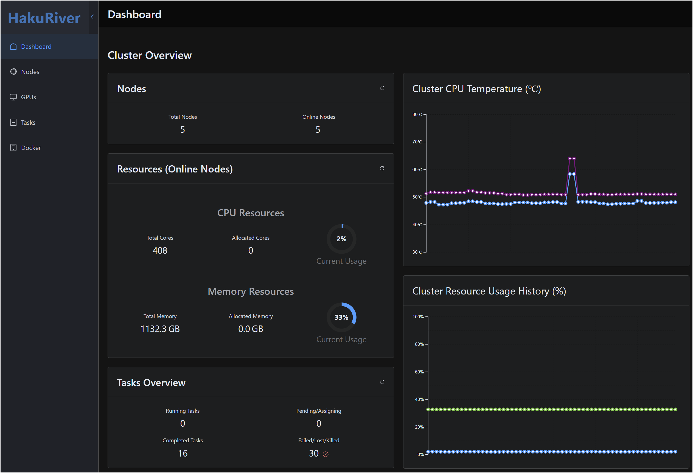
</p>
<p align="center">主儀表板提供叢集狀態和資源使用情況概覽，包括 CPU 和記憶體。</p>

<br>

### 節點檢視

<p align="center">
  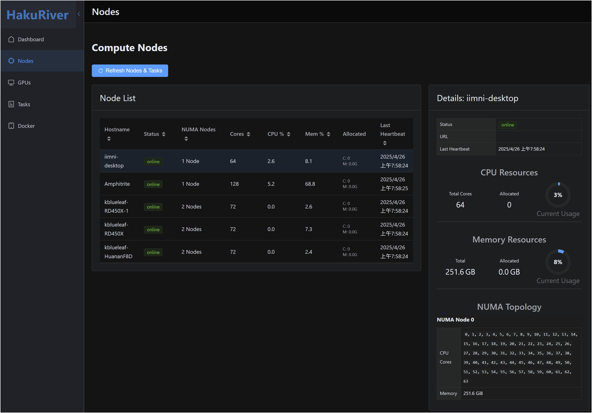
</p>
<p align="center">檢視已註冊節點的列表，包括其狀態、資源、已分配任務、NUMA 拓撲和 GPU 數量。</p>

<br>

### GPU 檢視

<p align="center">
  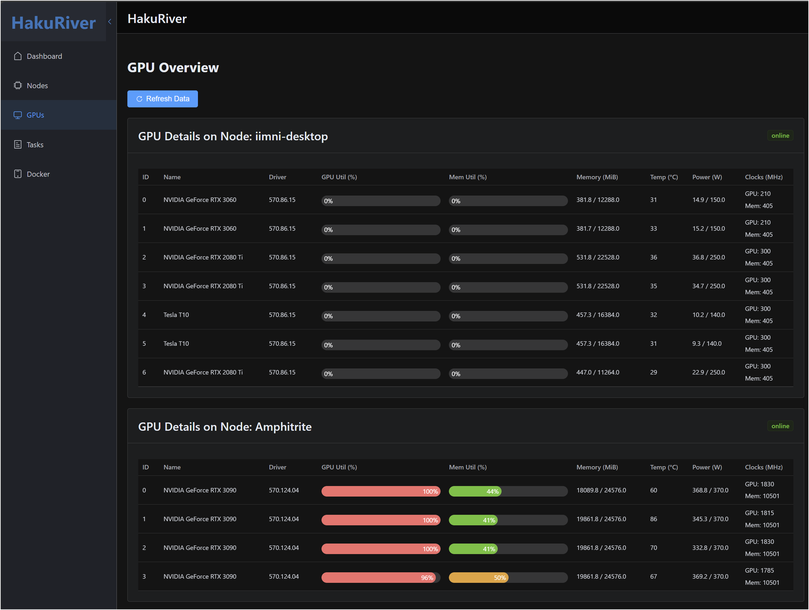
</p>
<p align="center">專用檢視，顯示節點報告的 GPU 詳細資訊和使用情況。</p>

<br>

### 任務工作流程

任務部分允許提交、列出和管理**命令任務**。

<h4>任務列表（命令任務）</h4>
<p align="center">
  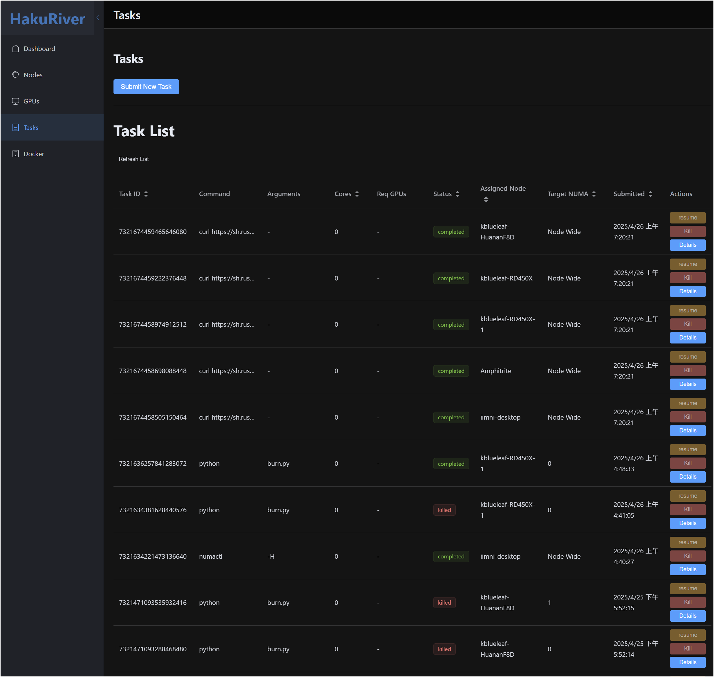
</p>
<p align="center">瀏覽所有命令任務，包括其狀態、分配的節點和基本資訊。</p>

<h4>命令任務提交與詳情</h4>
<table style="width: 100%; border-collapse: collapse; border: none;">
  <thead>
    <tr>
      <th style="width: 50%; text-align: center; padding: 10px; border-bottom: 1px solid #ddd;">命令任務提交表單</th>
      <th style="width: 50%; text-align: center; padding: 10px; border-bottom: 1px solid #ddd;">命令任務詳情對話框</th>
    </tr>
  </thead>
  <tbody>
    <tr>
      <td style="padding: 10px; vertical-align: top; border-right: 1px solid #ddd; border-bottom: 1px solid #ddd;">
        <p align="center">
          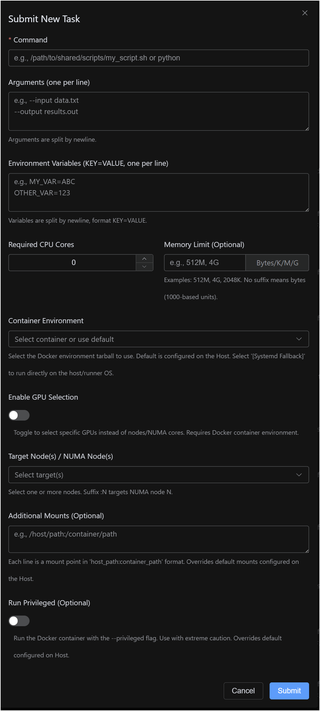
        </p>
        <p align="center" style="font-size: 0.9em; color: #555;">提交新命令任務時指定命令、參數、資源和目標（允許多目標、NUMA 和 GPU 選擇）。</p>
      </td>
      <td style="padding: 10px; vertical-align: top; border-bottom: 1px solid #ddd;">
        <p align="center">
          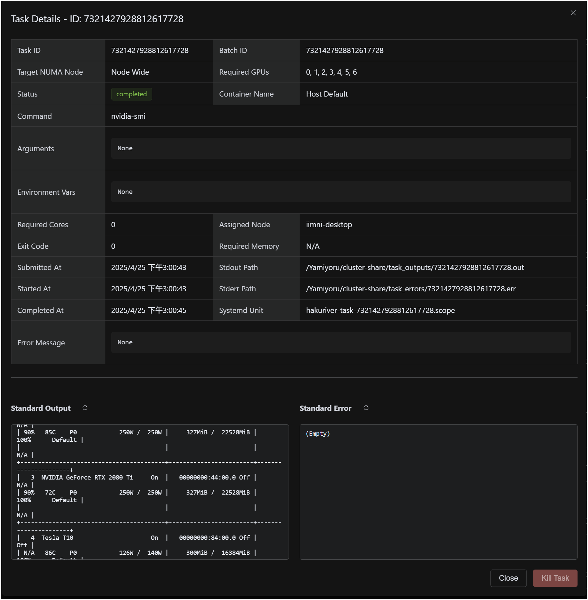
        </p>
        <p align="center" style="font-size: 0.9em; color: #555;">檢視選定命令任務的詳細資訊。</p>
      </td>
    </tr>
  </tbody>
</table>

<h4>任務日誌</h4>
<p align="center">
  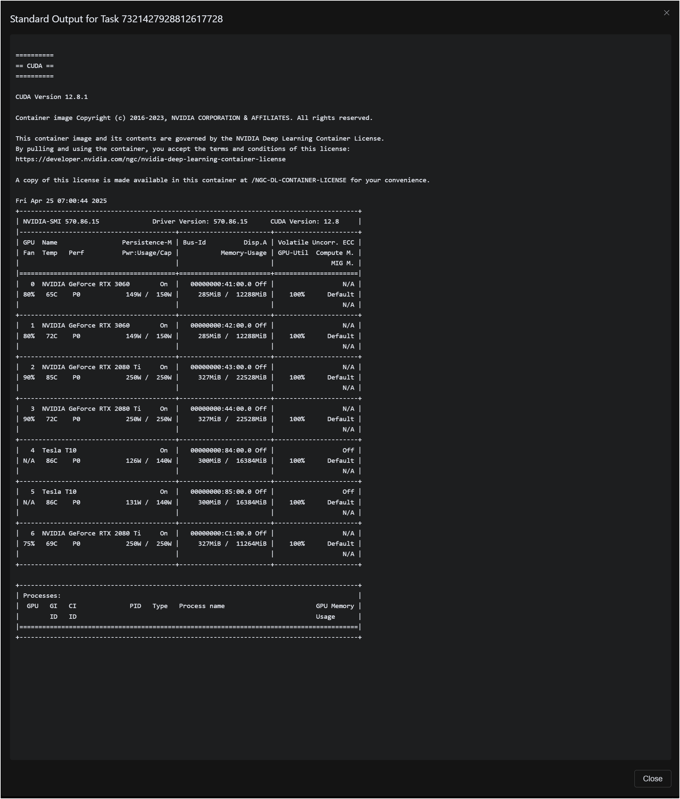
</p>
<p align="center">透過任務詳情中的專用模態視窗存取標準輸出和錯誤日誌。</p>

<br>

### VPS 任務工作流程

VPS 任務部分列出和管理活躍的 VPS 工作階段。

<h4>活躍 VPS 任務列表</h4>
<p align="center">
  <!-- 未提供 VPS 列表的特定截圖，根據代碼描述 -->
  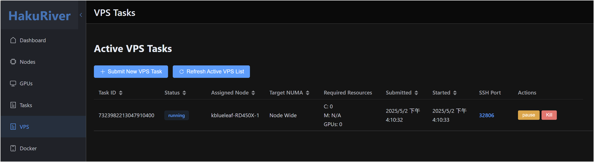
  <!-- 如果沒有特定的 VPS 截圖，使用佔位圖像或類似佈局 -->
</p>
<p align="center">瀏覽活躍的 VPS 任務，包括其狀態、分配的節點、分配的資源和 SSH 連接埠。（截圖可能顯示命令任務，但佈局相似）。</p>

<h4>VPS 任務提交</h4>
<p align="center">
  <!-- 未提供 VPS 提交的特定截圖，根據代碼描述 -->
  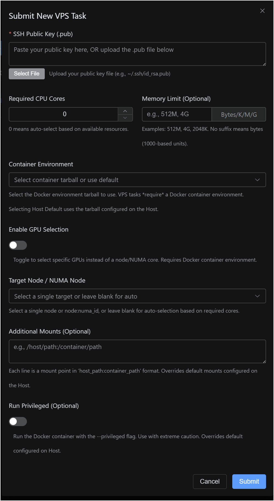
  <!-- 如果沒有特定的 VPS 截圖，使用佔位圖像或類似佈局 -->
</p>
<p align="center" style="font-size: 0.9em; color: #555;">提交新 VPS 任務時提供 SSH 公鑰並選擇資源需求和單一目標（節點/NUMA/GPU）或允許自動選擇。</p>

<br>

### Docker 工作流程

管理主機上的 Docker 環境和容器 tarball。

<h4>主機容器與 Tarball</h4>
<p align="center">
  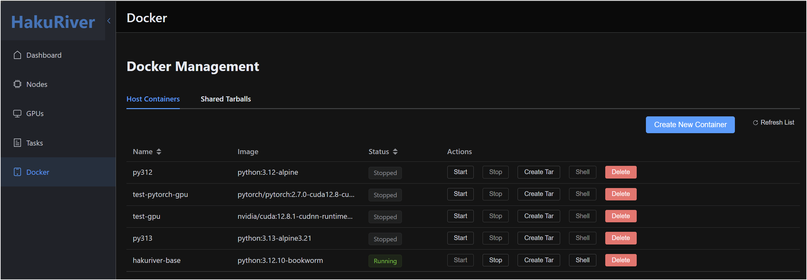
</p>
<p align="center">列出並管理主機上的持久性容器以及共享儲存中可用的 tarball。</p>

<h4>互動式容器 Shell</h4>
<p align="center">
  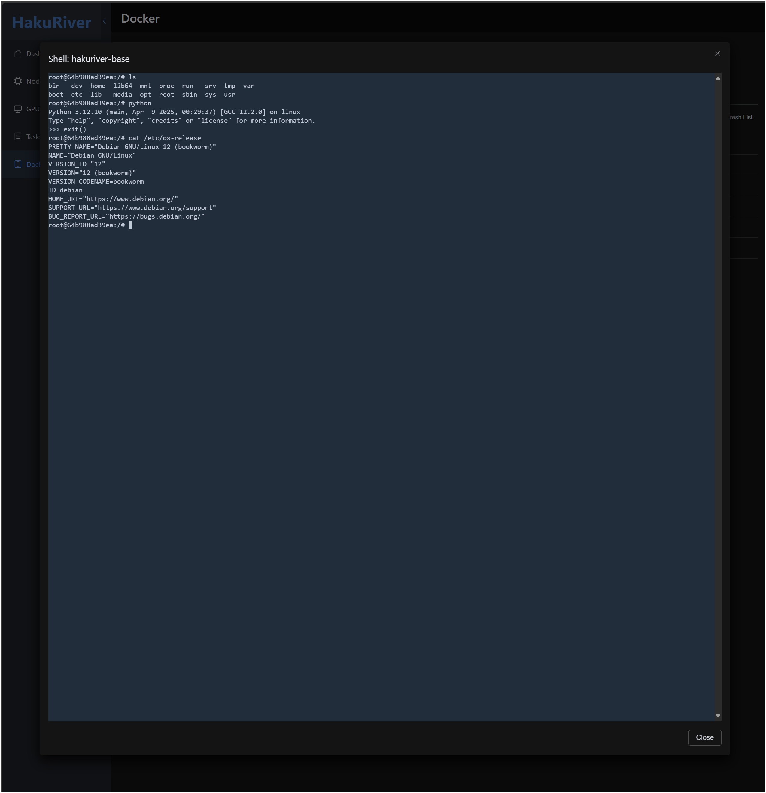
</p>
<p align="center">直接在執行中的主機容器中開啟一個網頁終端機工作階段，用於環境設置。</p>

<br>

---

**前置需求：**

* Node.js 和 npm/yarn/pnpm。
* 可從運行前端開發伺服器的位置存取的運行中 HakuRiver 主機。

**設置：**

```bash
cd frontend
npm install
```

**執行（開發）：**

1. 確保主機正在運行（例如 `http://127.0.0.1:8000`）。
2. 啟動 Vite 開發伺服器：
   ```bash
   npm run dev
   ```
3. 開啟提供的 URL（例如 `http://localhost:5173`）。
4. 開發伺服器將 `/api` 請求代理到主機（見 `vite.config.js`）。
5. **功能：**
   * 查看節點列表、狀態、資源、NUMA 拓撲和 **GPU 詳情**。
   * 查看 **命令任務** 列表、詳情（包括批次 ID、目標 NUMA、所需 GPU、容器）、日誌、終止/暫停/恢復。
   * 查看 **活躍 VPS 任務** 列表、詳情（包括目標 NUMA、所需 GPU、容器、**SSH 連接埠**）、終止/暫停/恢復。
   * 使用表單提交新 **命令任務**（允許 **多目標** 選擇，包括節點、NUMA 和 **GPU 選擇**，以及 **Docker 容器** 選擇）。
   * 使用表單提交新 **VPS 任務**（需要 SSH 公鑰，允許 **單一目標** 節點/NUMA/GPU 選擇或自動選擇，**Docker 容器** 選擇）。
   * 管理主機端 Docker 容器（建立、啟動、停止、刪除）。
   * 查看共享容器 tarball。
   * 透過終端模態視窗存取主機容器的互動式終端。

**建置（生產）：**

1. 建置靜態檔案：
   ```bash
   npm run build
   ```
2. 使用任何靜態網頁伺服器（Nginx、Apache 等）提供 `frontend/dist` 的內容。
3. **重要：** 配置您的生產網頁伺服器以代理 API 請求（例如對 `/api/*` 的請求）到實際運行的 HakuRiver 主機地址和連接埠，或在建置前修改 `src/services/api.js` 以使用主機的絕對 URL。

---

## 📝 未來工作 / 待辦事項

* **執行節點內持久性狀態管理：** 在執行節點內保存任務狀態（例如日誌、狀態等），以提高容錯能力。
* **基本排程策略：** 探索除簡單的「最先適合」節點選擇外的其他簡單但有用的選項。例如輪詢、最低負載、基於優先級等。
* **改進 SSH 代理的穩健性：** 改善 SSH 代理元件的錯誤處理和連接管理。
* **更複雜的 GPU 排程：** 實現多任務共享 GPU 的邏輯（例如使用 MIG 或可能限制每個 GPU 的處理程序/記憶體）。

## 🙏 致謝

* Gemini 2.5 pro：基本實現和初始 README 生成。
* Gemini 2.5 flash：README/文件改進。
* Claude 3.7 Sonnet：優化 logo SVG 程式碼。