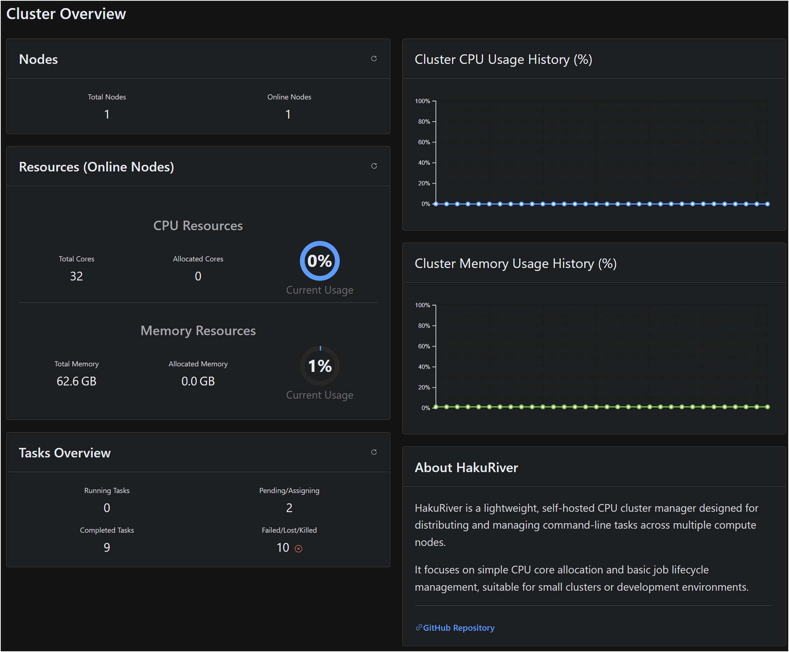
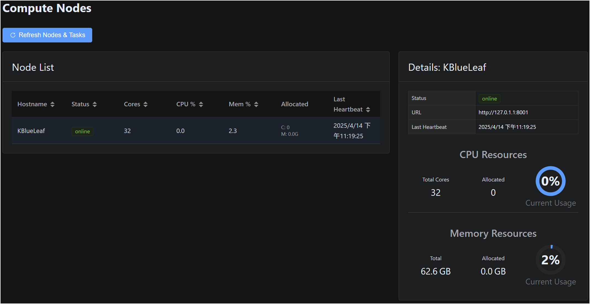
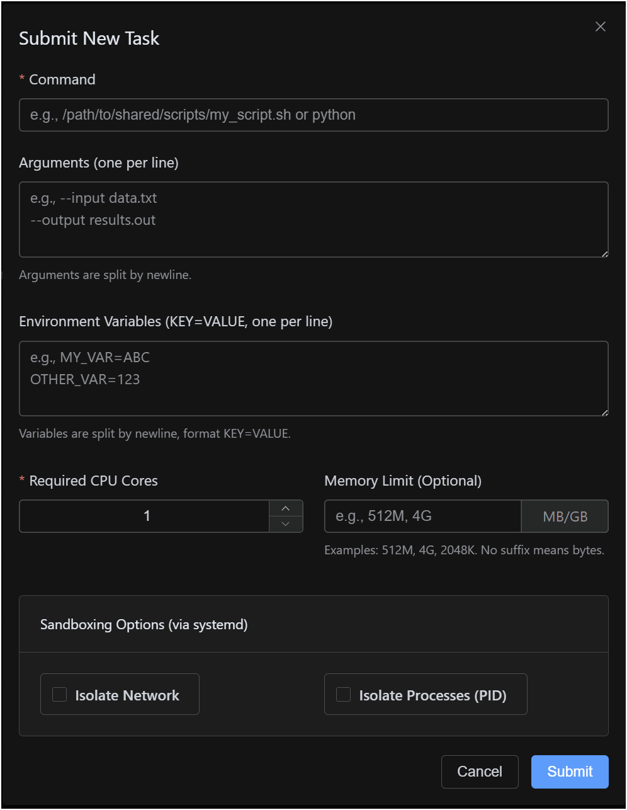

# HakuRiver - 迷你資源調度器

[](https://opensource.org/licenses/Apache-2.0)


***此專案為實驗性質，請自行承擔使用風險***

**HakuRiver** 是一個輕量級、可自行託管的叢集管理器，設計用於將命令列任務分發到不同的計算節點上。它專注於分配 CPU 核心（透過 **systemd CPU 配額**）和記憶體限制，管理任務生命週期，並且現在提供 **NUMA 節點指定**和**多節點任務提交**功能。

它利用 **systemd** 進行執行和基本的沙盒化 (`PrivateNetwork`、`PrivatePID`)。HakuRiver 非常適合小型研究叢集、開發環境或內部批次處理系統，在這些場景下，功能完備的高效能計算 (HPC) 排程器可能過於複雜，但仍需要一定程度的資源控制和分發能力。

---

## 🤔 HakuRiver 的適用範圍（與不適用範圍）

| HakuRiver 適用於...                                                                                     | HakuRiver 不適用於...                                                                                                      |
| :-------------------------------------------------------------------------------------------------------- | :------------------------------------------------------------------------------------------------------------------------- |
| ✅ 在小型叢集（例如 < 10 個節點）中管理命令列任務/腳本。                                                    | ❌ 在大型叢集上取代功能豐富的 HPC 排程器（Slurm、PBS、LSF）。                                                                  |
| ✅ 將任務分發到特定的 **NUMA 節點** 以進行效能調優 (`numactl`)。                                          | ❌ 複雜的資源管理，超出 CPU 配額、記憶體限制和 NUMA 綁定（例如 GPU 排程、網路頻寬、授權管理）。                                |
| ✅ 提交單一命令，使其同時在**多個節點或 NUMA 節點**上運行。                                                  | ❌ 複雜的任務依賴管理或工作流程編排（請使用 Airflow、Prefect、Snakemake、Nextflow）。                                      |
| ✅ 需要比複雜排程器更簡單替代方案的開發、測試或小型研究設置。                                               | ❌ 進階的排程策略（公平分享、搶佔、回填、複雜優先級）。HakuRiver 使用直接由使用者指定目標的方式。                               |
| ✅ 只需要基本的作業提交、狀態檢查、日誌檢索和終止功能的內部工具。                                           | ❌ 需要強大內建驗證/授權（超出網路可存取性）的高安全性、多租戶環境。                                                       |
| ✅ 主要運行 CPU/記憶體密集型應用程式。                                                                    | ❌ 自動優化 NUMA 佈局 – 使用者需指定目標。                                                                                  |
| ✅ 使用內附的 `hakurun` 工具在提交到叢集*之前*進行本地參數掃描。                                          | ❌ 用叢集提交取代 `hakurun` 本身 – 它們服務於不同目的（本地 vs 分散式）。                                                   |

---

## ✨ 功能特色

*   **透過 systemd 進行 CPU/RAM 資源分配：** 作業請求 CPU 核心（強制執行為 **CPU 配額百分比**）和**記憶體限制**，透過 `systemd-run` 應用。
*   **基於 Systemd 的任務執行：** 任務作為暫態的 systemd scope 單元運行 (`systemd-run --scope`)，以實現更好的生命週期管理和資源核算。
*   **NUMA 節點指定：** 可選擇使用 `numactl` 將任務綁定到特定的 NUMA 節點（需要在 Runner 上安裝 `numactl` 並設定路徑）。
*   **多節點/NUMA 任務提交：** 提交單一請求，即可在多個指定節點或節點內的特定 NUMA 節點上運行相同的命令。
*   **可選的沙盒化：** 可針對每個任務批次設定基本的 systemd 沙盒化 (`PrivateNetwork=yes`、`PrivatePIDs=yes`)。
*   **持久化的任務與節點記錄：** Host 維護一個 SQLite 資料庫，記錄節點（包含偵測到的 NUMA 拓撲）和任務（狀態、目標、資源請求、日誌）。
*   **節點健康與資源感知：** 基本的心跳機制可偵測離線的 Runner。Runner 回報整體的 CPU/記憶體使用率和 NUMA 拓撲。
*   **獨立的參數掃描工具 (`hakurun`)：** 用於在提交到叢集前進行本地參數掃描 (`span:{..}`、`span:[]`) 的工具。提升了平行 Python 執行的穩健性。
*   **網頁儀表板 (實驗性)：** Vue.js 前端，用於視覺化監控、任務提交（包含多目標）、狀態檢查和終止任務。

## 🏗️ 架構概觀

```ascii
+-----------------+      HTTP API       +-----------------+      HTTP API       +--------------------+
|  Client (CLI)   |<------------------->|   Host Server   |<------------------->|  Frontend (Web UI) |
| (hakuriver.cli) | (Submit, Status,    | (hakuriver.core)| (Node/Task Data,    | (Vue.js)           |
|                 |  Kill, List, ...)   |  - FastAPI      |  Submit, Kill)      |  - Monitoring      |
|                 |                     |  - Peewee (DB)  |                     |  - Submit Task     |
|                 |                     |  - Scheduling*  |                     |  - Check result    |
+-----------------+                     |  - State Mgmt   |                     +--------------------+
                                        +--------+--------+
                                                 | ▲  │ Registration, Heartbeat, Status Update
                                                 │ │  ▼ Task Execution Command, Kill Command
                                        +--------▼-+-------------+      +------------------------+
                                        | Runner Agent (Node 1)  |      | Runner Agent (Node N)  |
                                        | (hakuriver.core)       |      | (hakuriver.core)       |
                                        |  - FastAPI             |      |  - FastAPI             |
                                        |  - NUMA Detect         |      |  - NUMA Detect         |
                                        |  - systemd-run (+sudo) |      |  - systemd-run (+sudo) |
                                        |  - numactl             |      |  - numactl             |
                                        +------------------------+      +------------------------+
                                                    │                               │
 Shared Filesystem (NFS, etc.)                      │ Access (Scripts, Output)      │ Access (Scripts, Output)
+----------------------------------+                ▼                               ▼
| /path/to/shared_dir              |<------------------------------------------------
|  - scripts/                      |                │                               │
|  - task_outputs/ (*.out)         |                │ Access (Temporary data)       │ Access (Temporary data)
|  - task_errors/  (*.err)         |                ▼                               ▼
+----------------------------------+    Node 1 Local Filesystem         Node N Local Filesystem
                                       +--------------------------+     +--------------------------+
                                       | /path/to/local_temp_dir  |     | /path/to/local_temp_dir  |
                                       +--------------------------+     +--------------------------+

 Host Local Filesystem
+----------------------------------+
| /path/to/database/cluster.db     |
+----------------------------------+

* Scheduling: Host validates targets & resources but relies on user specification via Client/Frontend.
```

*   **Host (`hakuriver.host`)：** 中央協調者。管理節點註冊（包括 NUMA 拓撲）、追蹤節點狀態/資源、將任務資訊儲存在資料庫中、接收任務提交請求（包括多目標）、驗證目標、產生唯一的任務 ID，並將個別任務實例分派給適當的 Runner。
*   **Runner (`hakuriver.runner`)：** 運行在每個計算節點上的代理程式。偵測 NUMA 拓撲（透過 `numactl`）、向 Host 註冊（回報核心數、RAM、NUMA 資訊、URL）。定期發送心跳（包含 CPU/記憶體使用率）。使用 `sudo systemd-run` 執行被指派的任務，應用 CPU 配額、記憶體限制、可選的沙盒化以及可選的 `numactl` 綁定。將任務狀態更新回報給 Host。**需要為 `systemd-run` 和 `systemctl` 配置無密碼 `sudo`。**
*   **Client (`hakuriver.client`)：** 命令列工具。與 Host 通訊以提交任務（指定命令、參數、環境變數、資源，以及**一個或多個目標**，如 `host1` 或 `host1:0`）、查詢任務/節點狀態（包含 NUMA 資訊），以及終止任務。
*   **Frontend：** 可選的網頁介面，提供類似於 Client 的視覺化概覽和互動功能。
*   **Database：** Host 使用 SQLite（透過 Peewee）來儲存節點清單（包含 NUMA 拓撲，以 JSON 格式儲存）和任務詳細資訊（包含目標 NUMA ID、批次 ID）。
*   **Storage：**
    *   **Shared (`shared_dir`)：** 在 Host 和所有 Runner 上掛載於相同路徑。對於任務輸出日誌（`*.out`、`*.err`）以及可能共享的腳本/資料至關重要。
    *   **Local Temp (`local_temp_dir`)：** 節點特定的快速儲存空間，其路徑會作為 `HAKURIVER_LOCAL_TEMP_DIR` 環境變數注入給任務使用。

---

## 🚀 開始使用

### 安裝

1.  複製儲存庫：
    ```bash
    git clone https://github.com/KohakuBlueleaf/HakuRiver.git
    cd HakuRiver
    ```
2.  安裝套件（建議在虛擬環境中進行）：
    ```bash
    # 安裝 hakuriver 及其依賴項
    pip install .
    # 或用於開發：
    # pip install -e .
    ```

    這將使 `hakurun`、`hakuriver.host`、`hakuriver.runner` 和 `hakuriver.client` 可用。
3.  **(Runner 節點)** 如果您打算使用 NUMA 指定功能，請安裝 `numactl`：
    ```bash
    # Debian/Ubuntu 範例
    sudo apt update && sudo apt install numactl
    # CentOS/RHEL 範例
    sudo yum install numactl
    ```

---

## `hakurun`：本地參數掃描工具

`hakurun` 可協助**在本地**運行帶有多種參數組合的命令或 Python 腳本，這在提交到 HakuRiver 叢集前進行測試很有用。

*   **參數掃描：**
    *   `span:{start..end}` -> 整數（例如 `span:{1..3}` -> `1`, `2`, `3`）
    *   `span:[a,b,c]` -> 列表項目（例如 `span:[foo,bar]` -> `"foo"`, `"bar"`）
*   **執行：** 運行所有掃描參數的笛卡爾積。使用 `--parallel` 透過子處理程序並行運行組合。
*   **目標：** 運行 Python 模組 (`mymod`)、函式 (`mymod:myfunc`) 或可執行檔 (`python script.py`, `my_executable`)。

**範例 (`demo_hakurun.py`)：**

```python
# demo_hakurun.py
import sys, time, random, os # Added os import
time.sleep(random.random() * 0.1)
print(f"Args: {sys.argv[1:]}, PID: {os.getpid()}")
```

```bash
# 在本地並行運行 2 * 1 * 2 = 4 個任務
hakurun --parallel python ./demo_hakurun.py span:{1..2} fixed_arg span:[input_a,input_b]
```

**注意：** `hakurun` 是一個本地輔助工具。它**不會**與 HakuRiver 叢集互動。用它來產生您稍後可能會使用 `hakuriver.client` 單獨或作為批次提交的命令。

---

## 🔧 設定 - HakuRiver

*   您可以使用 `hakuriver.init` 建立一個全域預設設定檔，此命令會在 `~/.hakuriver/config.toml` 中建立一個預設設定檔，所有命令預設會使用此設定檔。
*   預設設定檔內容：`src/hakuriver/utils/default_config.toml`。
*   對於任何 `hakuriver.*` 命令，可以使用 `--config /path/to/custom.toml` 來覆蓋。
*   **需要檢視/編輯的關鍵設定：**
    *   `[network] host_reachable_address`：**必須**是 Runner 和 Client 可連線到的 Host 的 IP/主機名稱。
    *   `[network] runner_address`：**必須**是 Host 可連線到的 Runner 的 IP/主機名稱。
    *   `[paths] shared_dir`：共享儲存的絕對路徑（必須存在且在 Runner 節點上可寫，在 Host 節點上可讀）。
    *   `[paths] local_temp_dir`：本地暫存儲存的絕對路徑（必須存在且在 Runner 節點上可寫）。
    *   `[paths] numactl_path`：Runner 節點上 `numactl` 可執行檔的絕對路徑（例如 `/usr/bin/numactl`）。如果為空，Runner 將嘗試直接使用 `numactl`。
    *   `[database] db_file`：Host 的 SQLite 資料庫路徑。請確保目錄存在。

---

## 💻 使用方式 - HakuRiver 叢集

**1. 初始化資料庫 (在 Host 機器上運行一次)：**
   Host 會在啟動時嘗試此操作。確保 `db_file` 的目錄存在且可寫。如果升級時有結構變更，請刪除資料庫檔案。

**2. 啟動 Host 伺服器 (在管理節點上)：**

```bash
   hakuriver.host
   # 使用自訂設定檔：
   # hakuriver.host --config /path/to/host_config.toml
```

**3. 啟動 Runner 代理程式 (在每個計算節點上)：**

```bash
   # 重要：以具有 NOPASSWD sudo 權限的使用者身份運行以下命令：
   # /usr/bin/systemd-run, /usr/bin/systemctl
   # (用於啟動任務、設定資源限制、終止任務，如果透過 sudo 運行 numactl 也可能需要)
   # sudoers 範例條目：
   # your_user ALL=(ALL) NOPASSWD: /usr/bin/systemd-run, /usr/bin/systemctl

   hakuriver.runner
   # 使用自訂設定檔：
   # hakuriver.runner --config /path/to/runner_config.toml
```

   *如果找到並設定了 `numactl`，Runner 將偵測並回報其 NUMA 拓撲。*

**4. Systemd 執行注意事項：**

*   透過 `systemd-run` 運行的任務*不會*繼承 Runner 的工作目錄（通常在使用者家目錄或 `/` 中啟動）。請使用絕對路徑或環境變數 (`HAKURIVER_SHARED_DIR`, `HAKURIVER_LOCAL_TEMP_DIR`)。
*   任務環境包含透過 `--env` 設定的變數、`HAKURIVER_*` 變數，以及可能由 `systemd --user` 實例或系統實例繼承的變數，具體取決於 `sudo` 如何調用 `systemd-run`。
*   如果使用了 `numactl`，它會在 systemd scope 內將 `numactl` 命令加在使用者的實際命令之前。

**5. 使用 Client (`hakuriver.client`)：**

| 操作                        | 指令範例                                                                                                                                       | 備註                                                                         |
| :---------------------------- | :--------------------------------------------------------------------------------------------------------------------------------------------- | :--------------------------------------------------------------------------- |
| **列出節點**                  | `hakuriver.client --list-nodes`                                                                                                                | 顯示狀態、核心數、NUMA 摘要。                                                |
| **節點健康狀況**              | `hakuriver.client --health` <br> `hakuriver.client --health <node-hostname>`                                                               | 顯示詳細統計資料，若可用則包含完整的 NUMA 拓撲。                             |
| **提交單一任務**              | `hakuriver.client --target <host1> --cores 1 -- echo "Basic Task"`                                                                               | 在 `<host1>` 上的任何可用核心上運行。                                        |
| **提交 (NUMA)**               | `hakuriver.client --target <host1>:0 --cores 2 --memory 1G -- ./my_numa_script.sh`                                                               | 綁定到 `<host1>` 上的 NUMA 節點 0 運行。需要在 Runner 上安裝 `numactl`。      |
| **提交 (多 NUMA)**            | `hakuriver.client --target <host1>:0 --target <host1>:1 --cores 1 -- ./process_shard.sh`                                                         | 在 `<host1>` 上運行兩個任務實例，一個在 NUMA 0，一個在 NUMA 1。                |
| **提交 (多節點)**             | `hakuriver.client --target <host1>:0 --target <host2> --cores 4 --env P=1 -- ./parallel_job.sh`                                                  | 在 `<host1>` 的 NUMA 0 和 `<host2>` 的任何核心上運行。                        |
| **提交 (沙盒化)**             | `hakuriver.client --target <host1> --cores 1 --private-network --private-pid -- ./isolated_task.sh`                                              | 應用 systemd 沙盒化選項。                                                    |
| **檢查狀態**                  | `hakuriver.client --status <task_id>`                                                                                                            | 顯示詳細狀態，包含目標 NUMA、批次 ID。                                       |
| **終止任務**                  | `hakuriver.client --kill <task_id>`                                                                                                              | 請求終止特定的任務實例。                                                     |
| **提交 + 等待**               | `hakuriver.client --target <host1>:0 --wait -- sleep 30`                                                                                         | 等待指定的任務完成。對於多目標提交請謹慎使用。                               |
| **使用自訂設定檔**            | `hakuriver.client --config client.toml --list-nodes`                                                                                             | 載入客戶端設定檔覆蓋。                                                       |
| **與 hakurun 結合 (1)**     | `hakurun hakuriver.client --target <host1>:0 --cores 1 -- python script.py span:{1..10}<br>`(提交 10 個獨立的 HakuRiver 作業)                 | 用於提交許多相似的*獨立*叢集作業。                                             |
| **與 hakurun 結合 (2)**     | `hakuriver.client --target <host1>:0 --cores 4 -- hakurun --parallel python process.py span:{A..Z}<br>`(提交 1 個運行 hakurun 的 HakuRiver 作業) | 用於將許多小型相關步驟分組到*一個*叢集作業中。                                 |

   **`--target` 語法：**

| 格式               | 描述                               |
| :------------------- | :--------------------------------- |
| `my-node`          | 指定物理節點 `my-node`。           |
| `my-node:0`        | 指定 `my-node` 上的 NUMA 節點 0。  |
| `another-node:1`   | 指定 `another-node` 上的 NUMA 節點 1。 |

---

## 🌐 使用方式 - 前端網頁介面 (實驗性)

| 概覽                                           | 節點列表和任務列表                                                                          | 從管理介面提交任務                           |
| ---------------------------------------------- | ------------------------------------------------------------------------------------------- | ---------------------------------------------- |
|  |   |  |

HakuRiver 包含一個可選的 Vue.js 儀表板，用於視覺化監控和管理。

**先決條件：**

*   Node.js 和 npm/yarn/pnpm。
*   運行的 HakuRiver Host，並且可以從您運行前端開發伺服器的地方存取。

**設定：**

```bash
cd frontend
npm install
```

**運行 (開發模式)：**

1.  確保 Host 正在運行 (例如 `http://127.0.0.1:8000`)。
2.  啟動 Vite 開發伺服器：
    ```bash
    npm run dev
    ```
3.  開啟提供的 URL (例如 `http://localhost:5173`)。
4.  開發伺服器會將 `/api` 請求代理到 Host (請參閱 `vite.config.js`)。
5.  **功能：**
    *   查看節點列表、狀態、資源和 **NUMA 拓撲**。
    *   查看任務列表、詳細資訊（包含批次 ID、目標 NUMA）、日誌。
    *   使用表單提交新任務，表單包含一個**多目標選擇器**，允許選擇節點範圍或特定的 NUMA 節點。
    *   終止運行中的任務。

**建置 (生產環境)：**

1.  建置靜態檔案：
    ```bash
    npm run build
    ```
2.  使用任何靜態網頁伺服器 (Nginx、Apache 等) 提供 `frontend/dist` 目錄的內容。
3.  **重要：** 設定您的生產網頁伺服器以代理 API 請求 (例如，對 `/api/*` 的請求) 到實際運行的 HakuRiver Host 位址和埠號，類似於 Vite 開發伺服器的代理設定，或者在建置前修改 `src/services/api.js` 以使用 Host 的絕對 URL。

## 功能詳情

### NUMA 感知

現代的多插槽或高核心數 CPU 通常具有非均勻記憶體存取 (NUMA) 架構。存取與運行中 CPU 核心*相同* NUMA 節點（插槽）相連的記憶體，會比存取連接到*不同* NUMA 節點的記憶體更快。

```ascii
+------------------------------- Node: my-compute-01 ------------------------------+
| +------------- NUMA Node-------------+       +--------- NUMA Node 1 -----------+ |
| |  +--- Memory Bank 0 (64 GiB) ---+  |       | +--- Memory Bank 1 (64GiB) ---+ | │
| |  |                              |  |       | |                             | | │
| |  +------------------------------+  |       | +-----------------------------+ | │
| |        ▲                           |       |       ▲                         | │
| |        │ Fast Access               │       |       │ Fast Access             | │
| |  +-----▼------------------------+  |       | +-----▼-----------------------+ | │
| |  | CPU Cores [0, 1, 2, ... 15] <-Interconnect-> CPU Cores [16..31]         | | │
| |  +------------------------------+  |       | +-----------------------------+ | │
| +------------------------------------+       +---------------------------------+ │
+----------------------------------------------------------------------------------+

Example Task Binding:
  Task A --> Bound to NUMA Node 0 (Uses Cores 0-15, Prefers Memory Bank 0) via `numactl --cpunodebind=0 --membind=0 ...`
  Task B --> Bound to NUMA Node 1 (Uses Cores 16-31, Prefers Memory Bank 1) via `numactl --cpunodebind=1 --membind=1 ...`
```

*   **偵測：** Runner 使用 `numactl --hardware`（如果可用且透過 `numactl_path` 設定）來偵測其 NUMA 配置（節點、每個節點的核心、每個節點的記憶體）。
*   **回報：** Runner 在註冊期間將此拓撲資訊發送給 Host。
*   **指定：** 使用者可以透過 Client 或 Frontend 指定像 `my-compute-01:0` 這樣的目標，以請求任務特別在該主機的 NUMA 節點 0 上運行。
*   **執行：** Runner 在 `systemd-run` scope 內，將 `numactl --cpunodebind=<id> --membind=<id>` 命令加在使用者的任務命令之前，強制執行綁定。

### 多節點 / 多 NUMA 任務提交

使用者現在可以提交單一請求，HakuRiver 會將其複製到多個指定的目標上。

```ascii
+-----------------+       +----------------------------------------------------+
|  Client/        | ----> | Host Server                                        |
|  Frontend       |       | Receives:                                          |
|                 |       |  - Command: `my_script.sh --input {i}`             |
| Request:        |       |  - Cores: 2                                        |
|  Run my_script  |       |  - Targets: ["node1:0", "node1:1", "node2"]        |
|  on node1:0,    |       +----------------------------------------------------+
|  node1:1, node2 |        │                        │                        │                       
+-----------------+        │ Dispatch Task          │ Dispatch Task          │ Dispatch Task         
                           │ (ID: 101, Target: 1:0) │ (ID: 102, Target: 1:1) │ (ID: 103, Target: 2)
                 +---------▼----------+   +---------▼----------+   +---------▼----------+
                 | Runner (Node 1)    |   | Runner (Node 1)    |   | Runner (Node 2)    |
                 | Executes Task 101  |   | Executes Task 102  |   | Executes Task 103  |
                 | (numactl bind 0)   |   | (numactl bind 1)   |   | (no numactl)       |
                 +--------------------+   +--------------------+   +--------------------+
```

*   **請求：** Client/Frontend 發送一個包含 `targets` 列表（例如 `["node1:0", "node1:1", "node2"]`）的 `/submit` 請求。
*   **Host 處理：** Host 迭代處理目標列表。對於每個有效且可用的目標，它會：
    *   產生一個唯一的任務 ID（例如 101、102、103）。
    *   為該任務實例建立一個獨立的資料庫記錄，將其連結到目標節點/NUMA ID，並可能連結到一個共同的批次 ID。
    *   將任務實例分派給適當的 Runner，如果適用，則包含特定的 `target_numa_node_id`。
*   **回應：** Host 回應一個成功建立並分派的任務 ID 列表。

---

## 🙏 致謝

*   Gemini 2.5 pro：基本實作和初始 README 產生。
*   Claude 3.7 Sonnet：完善 logo SVG 程式碼。