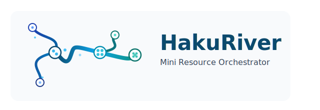

# KohakuRiver - 輕量級小型團隊叢集管理工具

[](https://www.gnu.org/licenses/agpl-3.0)
[](./README.md)
[](./README.zh.md)



**KohakuRiver** 是一套輕量級、自架式的叢集管理系統，專為在運算節點間分配命令列任務及啟動持久性互動式工作階段（稱為 **VPS 任務**，因使用體驗類似 Virtual Private Server）而設計。它主要透過 **Docker** 來管理可重現的任務環境，讓使用者能夠將容器當作可攜式「虛擬環境」來使用。KohakuRiver 負責協調這些容器化環境的建立、打包（透過 tarball）、分發及跨節點執行。

本系統提供資源配置（CPU/記憶體/GPU 限制）、多節點/NUMA/GPU 任務提交及狀態追蹤等功能，非常適合研究實驗室、中小型團隊、家用實驗室或開發環境使用——這些場景需要簡單、可重現的分散式任務執行及隨需互動式運算環境，而不想承擔複雜 HPC 排程器的額外負擔。

## KohakuRiver 簡介

### 問題背景

研究人員和小型團隊在使用少量運算節點（通常 3-8 台機器）時，常常面臨一個尷尬的處境：

- **機器太多**，無法用 SSH 和 Shell 腳本有效地手動管理
- **機器太少**，難以承受部署複雜 HPC 排程器（如 Slurm）的額外成本
- **容器編排系統**（如 Kubernetes）對於簡單的任務分發或單一長時間執行的互動式工作階段來說**過於複雜**

你擁有這些強大的運算資源，卻沒有一個有效率的方法，能在不增加大量維運負擔的情況下，將它們當作統一的運算資源來使用。

### 核心概念：把你的節點當成一台大電腦

KohakuRiver 透過以下關鍵設計原則，讓你能把小型叢集當作單一強大電腦來使用：

- **輕量級資源管理**：以最少的設定，在節點間分發命令列任務和互動式 VPS 工作階段
- **環境一致性**：使用 Docker 容器作為可攜式虛擬環境，而非複雜的應用程式部署
- **無縫同步**：自動將容器環境分發到 Runner 節點，無需在每個節點上手動設定
- **熟悉的工作流程**：透過簡單的介面提交任務，就像在本機執行命令或啟動環境一樣

> KohakuRiver 中的 Docker 就像是一個可以動態調整並自動同步的虛擬環境。你可以用同一個容器環境執行數十個任務或啟動多個互動式工作階段，但讓它們在完全不同的節點上執行。

### 運作方式

1. **環境管理**：使用 `kohakuriver docker container` 指令和互動式 shell，在 Host 節點上建立和自訂 Docker 容器。
2. **打包與分發**：使用 `kohakuriver docker tar create` 將環境打包成 tarball，存放在共享儲存空間中。
3. **自動同步**：Runner 節點在執行任務前，會自動從共享儲存空間取得所需的環境。
4. **平行/互動式執行**：提交單一命令、批次平行任務，或啟動持久性 VPS 任務在多個節點上執行，每個任務都隔離在自己的容器實例中。

這種做法符合以下理念：

> 對於小型本地叢集，應該優先選擇「輕量、簡單、剛剛好」的解決方案。你不需要把每個命令都打包成複雜的 Dockerfile——Docker 在這裡的用途是環境管理和同步。

KohakuRiver 對於部屬環境的預想：

- 節點之間可以輕易建立網路通訊
- 共享儲存空間隨時可用
- 不需要認證系統，或認證的複雜度可以降到最低
- 在這個規模下，高可用性和容錯能力並非首要考量

透過專注於小規模運算的實際需求，KohakuRiver 提供了多節點任務執行和互動式環境的「剛剛好」解決方案，不會帶來企業級系統的管理負擔。

---

## KohakuRiver 適合與不適合的場景

| KohakuRiver 適合... | KohakuRiver 不適合... |
|:---|:---|
| ✅ 管理小型叢集中的命令列任務/腳本和持久性 VPS 工作階段（通常 < 10-20 個節點） | ❌ 取代大型叢集上功能豐富的 HPC 排程器（如 Slurm、PBS、LSF） |
| ✅ **在由 KohakuRiver 管理的可重現 Docker 容器環境中執行任務和 VPS 工作階段** | ❌ 協調複雜的多服務應用程式（像 Kubernetes 或 Docker Compose） |
| ✅ **在 Host 上進行互動式環境設定，並將這些環境打包成可攜式 tarball 進行分發** | ❌ 自動管理容器*內部*的複雜軟體相依性（使用者透過 Host 的 shell 設定環境） |
| ✅ **方便地在節點/NUMA 區域/GPU 上提交獨立的命令列任務、批次平行任務或單一實例 VPS 工作階段** | ❌ 複雜的任務相依性管理或工作流程編排（請使用 Airflow、Prefect、Snakemake、Nextflow） |
| ✅ 提供具備 SSH 存取的隨需互動式運算環境（VPS 任務） | ❌ 提供高可用、負載平衡的生產*服務*供外部使用者直接存取 |
| ✅ 個人、研究實驗室、小型團隊或家用實驗室需要*簡單*的多節點任務/VPS 管理系統 | ❌ 部署或管理高可用、任務關鍵型的生產*服務* |
| ✅ 提供輕量級系統，在受控環境中進行分散式任務執行，維護負擔最小 | ❌ 需要強健內建認證和授權機制的高安全性、多租戶環境 |

---

## 功能特色

- **託管式 Docker 環境工作流程：**
  - 在 Host 上建立持久性基礎容器（`kohakuriver docker container create`）
  - 與 Host 容器互動/安裝軟體（`kohakuriver docker container shell`）
  - 將環境提交並打包成版本化 tarball（`kohakuriver docker tar create`）
- **容器化任務執行**：命令任務在指定的 Docker 環境中執行（由 KohakuRiver 管理）
- **VPS 任務與 SSH 存取**：啟動配置了 SSH daemon 的持久性 Docker 容器，用於互動式工作階段。提供你的公鑰即可取得 root 存取權限
- **SSH 代理**：透過 Host 伺服器作為中繼，安全地用 SSH 連接到你的 VPS 任務，無需直接存取各 Runner 節點的動態 SSH port
- **自動化環境同步**：Runner 在執行任務前，會自動檢查並從共享儲存空間同步所需的容器 tarball 版本
- **CPU/RAM 資源配置**：任務可請求 CPU 核心數（`-c/--cores`）和記憶體限制（`-m/--memory`），適用於 Docker 任務和 VPS 任務
- **NUMA 節點指定**：可選擇將任務綁定到特定 NUMA 節點（`--target node:numa_id`）。命令任務支援多個 NUMA 目標；VPS 任務則指定單一節點或 NUMA 節點
- **GPU 資源配置**：在目標節點上請求特定 GPU 裝置（`--target node::gpu_id1,gpu_id2...`），適用於 Docker 任務和 VPS 任務。Runner 透過心跳回報可用的 GPU
- **多節點/NUMA/GPU 任務提交**：提交單一請求，在多個指定節點、特定 NUMA 節點或特定 GPU 裝置上執行相同命令
- **持久性任務與節點記錄**：Host 維護一個 SQLite 資料庫，記錄節點（包括偵測到的 NUMA 拓撲和 GPU 資訊）和任務（狀態、類型、目標、資源、日誌、使用的容器、VPS 的 SSH port）
- **節點健康與資源感知**：基本心跳機制偵測離線的 Runner。Runner 回報整體 CPU/記憶體使用率、NUMA 拓撲和 GPU 詳情
- **Web 儀表板**：Vue.js 前端，用於視覺化監控、任務提交（包括多目標和容器/GPU 選擇）、狀態檢查以及終止/暫停/恢復任務。包含 Host 容器和任務終端機的網頁式終端機存取。有專門的節點、GPU 和 VPS 任務檢視
- **任務控制**：透過 CLI 或 Web UI 暫停和恢復執行中的任務

---

## 快速入門指南

### 前置需求

- Python >= 3.10
- Host 和所有 Runner 節點都可存取的共享檔案系統
- **Host 節點**：已安裝 Docker Engine（用於管理環境和建立 tarball）
- **Runner 節點**：已安裝 Docker Engine（用於執行容器化任務和 VPS）。`numactl` 為選用（僅 NUMA 綁定功能需要）。`nvidia-ml-py` 和 NVIDIA 驅動程式為選用（僅 GPU 回報/配置需要）
- **Client 機器**：已安裝 SSH client（`ssh` 指令）
- **Docker Engine**：確保 data-root 和 storage driver 設定正確。執行 `docker run hello-world` 確認 Docker 運作正常

### 步驟

1. **安裝 KohakuRiver**（在 Host、所有 Runner 節點和 Client 機器上）：

   ```bash
   # 複製儲存庫
   git clone https://github.com/KohakuBlueleaf/KohakuRiver.git
   cd KohakuRiver

   # 安裝
   pip install .

   # 包含 GPU 監控支援（需要 nvidia-ml-py 和 nvidia 驅動程式）
   pip install ".[gpu]"
   ```

2. **設定 KohakuRiver**（在 Host、所有 Runner 和 Client 機器上）：

   ```bash
   # 產生預設設定檔
   kohakuriver init config --generate
   ```

   編輯設定檔：
   - **Host 設定** (`~/.kohakuriver/host_config.py`)：
     - **重要**：將 `HOST_REACHABLE_ADDRESS` 設為 Runner/Client 可存取的 Host IP/主機名稱
     - **重要**：將 `SHARED_DIR` 設為你的共享儲存路徑（例如 `/mnt/cluster-share`）
   - **Runner 設定** (`~/.kohakuriver/runner_config.py`)：
     - **重要**：將 `HOST_ADDRESS` 設為 Host 的 IP/主機名稱
     - **重要**：將 `SHARED_DIR` 設為相同的共享儲存路徑

3. **啟動 Host 伺服器**（在管理節點上）：

   ```bash
   kohakuriver.host
   # 或使用特定設定檔：kohakuriver.host --config /path/to/host_config.py
   ```

   **使用 Systemd（建議用於正式環境）：**
   ```bash
   kohakuriver init service --host
   sudo systemctl start kohakuriver-host
   sudo systemctl enable kohakuriver-host
   ```

4. **啟動 Runner Agent**（在每個運算節點上）：

   ```bash
   kohakuriver.runner
   # 或使用特定設定檔：kohakuriver.runner --config /path/to/runner_config.py
   ```

   **使用 Systemd：**
   ```bash
   kohakuriver init service --runner
   sudo systemctl start kohakuriver-runner
   sudo systemctl enable kohakuriver-runner
   ```

5. **（選用）準備 Docker 環境**（在 Client/Host 上）：

   ```bash
   # 在 Host 上建立基礎容器
   kohakuriver docker container create python:3.12-slim my-py312-env

   # 互動式安裝軟體
   kohakuriver docker container shell my-py312-env
   # （在容器內）pip install numpy pandas torch
   # （在容器內）exit

   # 打包成 tarball
   kohakuriver docker tar create my-py312-env
   ```

6. **提交你的第一個任務**（從 Client 機器）：

   ```bash
   # 使用預設 Docker 環境在 node1 上提交簡單的 echo 命令
   kohakuriver task submit -t node1 -- echo "Hello KohakuRiver!"

   # 使用你的自訂環境在 node2 上以 2 核心執行 Python 腳本
   # （假設 myscript.py 在共享目錄中，可透過 /shared 存取）
   kohakuriver task submit -t node2 -c 2 --container my-py312-env -- python /shared/myscript.py

   # 在 node3 上使用 GPU 0 和 1 提交 GPU 命令任務
   kohakuriver task submit -t node3::0,1 --container my-cuda-env -- python /shared/train_gpu_model.py
   ```

7. **啟動 VPS 任務**（從 Client 機器）：

   ```bash
   # 建立具有 4 核心和 8GB 記憶體的 VPS
   kohakuriver vps create -t node1 -c 4 -m 8G

   # 透過 SSH 代理連線
   kohakuriver ssh connect <task_id>

   # 或使用 WebSocket 終端機
   kohakuriver connect <task_id>
   ```

---

## 架構

```
┌─────────────────────────────────────────────────────────────┐
│  Clients: CLI / Web Dashboard                               │
└──────────────────────────┬──────────────────────────────────┘
                           │
┌──────────────────────────▼──────────────────────────────────┐
│  HOST SERVER (Port 8000)                                    │
│  - 任務排程與分派                                           │
│  - 節點註冊與健康監控                                       │
│  - Docker 環境管理                                          │
│  - VPS 存取的 SSH 代理 (Port 8002)                          │
│  - SQLite 資料庫儲存狀態                                    │
└──────────────────────────┬──────────────────────────────────┘
                           │
         ┌─────────────────┼─────────────────┐
         ▼                 ▼                 ▼
┌─────────────────┐ ┌─────────────────┐ ┌─────────────────┐
│  RUNNER 1       │ │  RUNNER 2       │ │  RUNNER N       │
│  Port 8001      │ │  Port 8001      │ │  Port 8001      │
│  - 任務執行     │ │  - 任務執行     │ │  - 任務執行     │
│  - VPS 管理     │ │  - VPS 管理     │ │  - VPS 管理     │
│  - 資源監控     │ │  - 資源監控     │ │  - 資源監控     │
└─────────────────┘ └─────────────────┘ └─────────────────┘

┌─────────────────────────────────────────────────────────────┐
│  SHARED STORAGE (/mnt/cluster-share)                        │
│  - kohakuriver-containers/  (Docker tarball)                │
│  - shared_data/             (在任務中掛載為 /shared)        │
└─────────────────────────────────────────────────────────────┘
```

---

## CLI 參考

### 任務管理
```bash
kohakuriver task list                      # 列出所有任務
kohakuriver task submit [OPTIONS] -- CMD   # 提交命令任務
kohakuriver task status <task_id>          # 取得任務狀態
kohakuriver task kill <task_id>            # 終止執行中的任務
kohakuriver task pause <task_id>           # 暫停任務
kohakuriver task resume <task_id>          # 恢復暫停的任務
```

### VPS 管理
```bash
kohakuriver vps list                       # 列出 VPS 實例
kohakuriver vps create [OPTIONS]           # 建立 VPS
kohakuriver vps stop <task_id>             # 停止 VPS
kohakuriver ssh connect <task_id>          # 透過代理 SSH 到 VPS
kohakuriver connect <task_id>              # WebSocket 終端機連接 VPS
```

### 節點管理
```bash
kohakuriver node list                      # 列出已註冊的節點
```

### Docker 管理
```bash
kohakuriver docker container list          # 列出 Host 容器
kohakuriver docker container create IMG NAME  # 從映像檔建立容器
kohakuriver docker container shell NAME    # 進入容器的 shell
kohakuriver docker container start NAME    # 啟動容器
kohakuriver docker container stop NAME     # 停止容器
kohakuriver docker container delete NAME   # 刪除容器
kohakuriver docker tar list                # 列出 tarball
kohakuriver docker tar create NAME         # 從容器建立 tarball
kohakuriver docker tar delete NAME         # 刪除 tarball
```

### 設定
```bash
kohakuriver init config --generate         # 產生設定檔
kohakuriver init config --host             # 僅產生 host 設定
kohakuriver init config --runner           # 僅產生 runner 設定
kohakuriver init service --all             # 註冊所有 systemd 服務
kohakuriver init service --host            # 註冊 host 服務
kohakuriver init service --runner          # 註冊 runner 服務
```

---

## 設定

設定檔使用 Python 搭配 KohakuEngine。如果存在，會自動從 `~/.kohakuriver/` 載入。

### Host 設定 (`~/.kohakuriver/host_config.py`)

| 選項 | 類型 | 預設值 | 說明 |
|------|------|--------|------|
| `HOST_BIND_IP` | str | `"0.0.0.0"` | Host 伺服器綁定的 IP 位址 |
| `HOST_PORT` | int | `8000` | API 伺服器連接埠 |
| `HOST_SSH_PROXY_PORT` | int | `8002` | VPS 存取的 SSH 代理連接埠 |
| `HOST_REACHABLE_ADDRESS` | str | `"127.0.0.1"` | **重要**：Runner 用來連接 Host 的 IP/主機名稱 |
| `SHARED_DIR` | str | `"/mnt/cluster-share"` | 共享儲存路徑（所有節點必須相同） |
| `DB_FILE` | str | `"/var/lib/kohakuriver/kohakuriver.db"` | SQLite 資料庫路徑 |
| `DEFAULT_CONTAINER_NAME` | str | `"kohakuriver-base"` | 任務的預設環境 |

### Runner 設定 (`~/.kohakuriver/runner_config.py`)

| 選項 | 類型 | 預設值 | 說明 |
|------|------|--------|------|
| `RUNNER_BIND_IP` | str | `"0.0.0.0"` | Runner 綁定的 IP 位址 |
| `RUNNER_PORT` | int | `8001` | Runner API 連接埠 |
| `HOST_ADDRESS` | str | `"127.0.0.1"` | **重要**：Host 伺服器位址 |
| `HOST_PORT` | int | `8000` | Host 伺服器連接埠 |
| `SHARED_DIR` | str | `"/mnt/cluster-share"` | 共享儲存路徑（必須與 Host 相同） |
| `LOCAL_TEMP_DIR` | str | `"/tmp/kohakuriver"` | 本地暫存儲存 |

### 環境變數

| 變數 | 說明 | 預設值 |
|------|------|--------|
| `KOHAKURIVER_HOST` | Host 伺服器位址 | `localhost` |
| `KOHAKURIVER_PORT` | Host 伺服器連接埠 | `8000` |
| `KOHAKURIVER_SSH_PROXY_PORT` | SSH 代理連接埠 | `8002` |
| `KOHAKURIVER_SHARED_DIR` | 共享儲存路徑 | `/mnt/cluster-share` |

---

## Web 儀表板

Vue.js 前端提供：
- 叢集總覽，包含節點狀態和資源監控
- 任務提交，可選擇目標和設定資源
- VPS 建立，包含 SSH 金鑰管理
- Docker 環境管理（容器和 tarball）
- 容器和任務的網頁式終端機存取
- GPU 使用率監控

```bash
cd src/kohakuriver-manager
npm install
npm run dev
```

---

## 需求摘要

| 元件 | 需求 |
|------|------|
| **Host 節點** | Docker Engine、Python >= 3.10、共享儲存存取權限 |
| **Runner 節點** | Docker Engine、Python >= 3.10、共享儲存存取權限、選用：`numactl`、`nvidia-ml-py` |
| **Client 機器** | Python >= 3.10、SSH client |
| **共享儲存** | NFS 或類似方案、所有節點相同的掛載路徑、讀寫權限 |

---

## 授權

本專案採用 **GNU Affero General Public License v3.0 (AGPL-3.0)** 授權。

如需商業或專有用途的授權豁免，請聯繫：**kohaku@kblueleaf.net**
