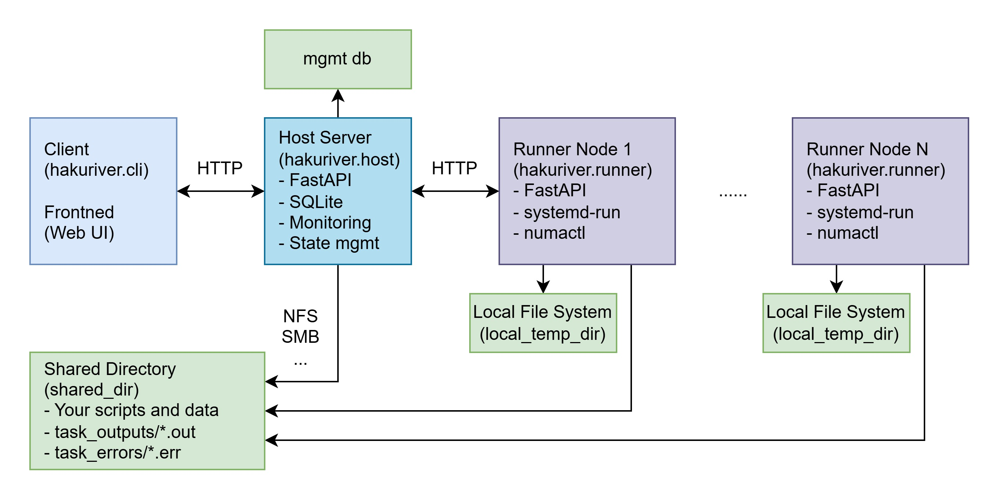

# HakuRiver - 共享容器叢集

| English | 中文 (你在這) |
| :------ | :--- |
| [English](./README.md) | [中文](./README.zh.md) |

[](https://opensource.org/licenses/Apache-2.0)


***此專案仍處於實驗階段，使用風險自負***

**HakuRiver** 是一個輕量級、自託管的叢集管理系統，專為在計算節點間分配命令列任務而設計。它主要利用 **Docker** 來管理可重現的任務環境，讓使用者能將容器視為便攜式「虛擬環境」。HakuRiver 協調這些容器化環境的建立、打包（通過 tarball）、分發和在節點間的執行。

它提供資源分配（CPU/記憶體限制）、多節點/NUMA 任務提交和狀態追蹤功能，非常適合研究實驗室、中小型團隊、家庭實驗室或開發環境，這些環境需要簡單、可重現的分散式任務執行，而不需承擔複雜 HPC 排程器的額外負擔。


## HakuRiver 簡介

### 問題背景

研究人員和小型團隊在使用少量計算節點（通常 3-8 台機器）時，經常面臨尷尬的中間地帶：

- **機器太多**，無法有效地透過 SSH 和 Shell 腳本手動管理
- **機器太少**，難以接受部署複雜 HPC 排程器（如 Slurm）的額外開銷
- **容器編排系統**（如 Kubernetes）對於簡單的任務分發而言**過於複雜**

您擁有這些強大的計算資源，卻沒有高效方法在不增加大量運維開銷的情況下，將它們作為統一的計算資源使用。

### 核心概念：將節點視為一台大型電腦

HakuRiver 通過以下關鍵設計原則，讓您將小型叢集視為單一強大電腦：

- **輕量級資源管理**：以最少的設置在節點間分發命令列任務
- **環境一致性**：使用 Docker 容器作為可攜式虛擬環境，而非複雜的應用部署
- **無縫同步**：自動將容器環境分發到執行節點，無需在每個節點上手動設置
- **熟悉的工作流程**：通過簡單的介面提交任務，就像在本地機器運行命令一樣

> HakuRiver 中的 Docker 作為一種可動態調整和自動同步的虛擬環境。您可以運行數十個使用相同容器環境的任務，但在完全不同的節點上執行它們。

### 運作原理

1. **環境管理**：透過互動式 Shell 在管理節點上建立和自定義 Docker 容器
2. **打包與分發**：環境打包為 tarball 並存儲在共享存儲中
3. **自動同步**：執行節點在執行任務前自動獲取所需環境
4. **並行執行**：提交單一命令或批次在多個節點上運行，每個任務在自己的容器實例中隔離

這種方法符合以下理念：

> 對於小型本地叢集，應優先選擇「輕量、簡單、恰好足夠」的解決方案。您不需要將每個命令打包成複雜的 Dockerfile - Docker 在這裡的目的是環境管理和同步。

HakuRiver 建立在小型本地叢集的實際假設基礎上：

- 節點可以輕易建立網絡通訊
- 共享存儲隨時可用
- 無須認證系統或認證複雜性可以最小化
- 在這種規模下，高可用性和容錯能力不那麼關鍵

通過專注於小規模計算的實際需求，HakuRiver 提供了多節點任務執行的「恰到好處」解決方案，無需承擔企業級系統的管理負擔。

---

## 🤔 HakuRiver 適用與不適用的場景

| HakuRiver 適用於...                                                                                                             | HakuRiver 不適用於...                                                                                                                    |
| :------------------------------------------------------------------------------------------------------------------------------- | :------------------------------------------------------------------------------------------------------------------------------------- |
| ✅ 管理小型叢集中的命令列任務/指令碼（通常 < 10-20 個節點）。                                                                   | ❌ 替代大型叢集上功能豐富的 HPC 排程器（如 Slurm、PBS、LSF）。                                                                         |
| ✅ **在可重現的 Docker 容器環境中執行任務。**                                                                                      | ❌ 協調複雜的多服務應用程式（如 Kubernetes 或 Docker Compose）。                                                                        |
| ✅ **在宿主機上進行互動式環境設置，並將這些環境打包為便攜式 tarball 進行分發。**                                                    | ❌ 自動管理容器*內部*的複雜軟體相依性（使用者通過宿主機的 shell 設置環境）。                                                          |
| ✅ **方便地在節點/NUMA 區域間提交獨立的命令列任務或批次並行任務。**                                                              | ❌ 複雜的任務相依性管理或工作流程協調（請使用 Airflow、Prefect、Snakemake、Nextflow）。                                                  |
| ✅ 個人、研究實驗室、小型團隊或家庭實驗室需要*簡單*的多節點任務管理系統。                                                          | ❌ 部署或管理高度可用、任務關鍵型的生產*服務*。                                                                                               |
| ✅ 提供輕量級系統，在受控環境中分散式執行任務時需要最少的維護開銷。                                                            | ❌ 需要強大內建認證和授權層的高安全性、多租戶環境。                                                                                 |
| ✅ 使用內建的 `hakurun` 工具在叢集提交*前*進行本地參數掃描。                                                                  | ❌ 用叢集提交替代 `hakurun` 本身 – 它們服務於不同目的（本地執行 vs 分散式執行）。                                                  |

---

## ✨ 功能特色

* **管理 Docker 環境工作流程：**
    * 在宿主機上設置持久性基礎容器（`hakuriver.docker create-container`）。
    * 與宿主機容器互動/安裝軟體（`hakuriver.docker-shell`）。
    * 將環境提交並打包成版本化 tarball（`hakuriver.docker create-tar`）。
    * 將 tarball 放置在共享儲存空間供執行器使用。
* **容器化任務執行：** 任務在指定的 Docker 環境中運行（`docker run --rm`）。
* **自動化環境同步：** 執行器在運行任務前自動檢查並從共享儲存同步所需的容器 tarball 版本。
* **Systemd 備用執行：** 可選擇使用 `systemd-run --scope` 直接在節點上運行任務，以獲得系統級訪問權限或在不需要 Docker 時使用。
* **CPU/RAM 資源分配：** 任務可請求 CPU 核心（作為 Docker `--cpus` 或 systemd `CPUQuota`）和記憶體限制（Docker `--memory` 或 systemd `MemoryMax`）。
* **NUMA 節點定位（Systemd 備用）：** 可選擇使用 `numactl` 將 *systemd-run* 任務綁定到特定 NUMA 節點。（Docker 中的 NUMA 支援仍在開發中）。
* **多節點/NUMA 任務提交：** 通過單一請求在多個指定節點或特定 NUMA 節點上運行相同命令（在 Docker 內或通過 systemd）。
* **持久性任務和節點記錄：** 宿主機維護一個 SQLite 資料庫，記錄節點（包括檢測到的 NUMA 拓撲）和任務（狀態、目標、資源、日誌、使用的容器）。
* **節點健康和資源感知：** 基本心跳檢測離線執行器。執行器報告整體 CPU/記憶體使用情況和 NUMA 拓撲。
* **網頁儀表板（實驗性）：** Vue.js 前端用於視覺化監控、任務提交（包括多目標和容器選擇）、狀態檢查和終止任務。
* **獨立參數展開工具（`hakurun`）：** 用於在提交到叢集前進行本地參數掃描的工具。

---

## 🚀 快速入門指南

### 前置需求

* Python >= 3.10
* 中央管理機和所有運行機節點均可存取的共享檔案系統。
* **中央管理機節點：** 已安裝 Docker Engine（用於管理環境和建立 tarball）。
* **運行機節點：** 已安裝 **Docker Engine**（用於執行容器化任務）。`numactl` 為可選（僅在使用 systemd/NUMA 備用時需要）。運行機使用者可能需要無密碼 `sudo` 訪問權限，取決於 Docker 設置（`docker` 命令）或使用 systemd 備用時（`systemd-run`、`systemctl`）。
* **Docker Engine**：除了安裝外，您不需要任何額外的 Docker 配置，但請確保 data-root 和儲存驅動程式設置正確。HakuRiver 使用預設的 Docker 儲存驅動程式和 data-root（`/var/lib/docker`），但如有需要可在 Docker 守護程式配置中變更。運行 `docker run hello-world` 確認 Docker 運作正常。

### 步驟

1. **安裝 HakuRiver**（在中央管理機、運行機和客戶端機器上）：
   ```bash
   # 使用 pip（推薦）
   python -m pip install hakuriver
   # 使用 pip 從 GitHub 安裝（最新版本）
   python -m pip install git+https://github.com/KohakuBlueleaf/HakuRiver.git
   # 或克隆並本地安裝
   # git clone https://github.com/KohakuBlueleaf/HakuRiver.git
   # cd HakuRiver
   # pip install .
   ```

2. **配置 HakuRiver**（在中央管理機、運行機和客戶端上）：
   * 建立預設配置檔：
     ```bash
     hakuriver.init config
     ```
   * 編輯配置檔（`~/.hakuriver/config.toml`）：
     ```bash
     vim ~/.hakuriver/config.toml
     ```
   * **重要**：設置 `host_reachable_address` 為運行機/客戶端可存取的中央管理機 IP/主機名。
   * **重要**：設置 `runner_address` 為中央管理機可存取的運行機 IP/主機名。
   * **重要**：設置 `shared_dir` 為共享儲存的絕對路徑（例如 `/mnt/shared/hakuriver`）。確保此目錄存在且可寫入。
   * 根據需要調整其他設置，如連接埠、Docker 預設值等。（詳見下方配置部分）。

3. **啟動中央管理機伺服器**（在管理節點上）：
   ```bash
   hakuriver.host
   # （可選）使用特定配置：hakuriver.host --config /path/to/host.toml
   ```
   * **對於 Systemd：**
     ```bash
     hakuriver.init service --host [--config /path/to/host.toml]
     sudo systemctl restart hakuriver-host.service
     sudo systemctl enable hakuriver-host.service
     ```

4. **啟動運行機代理**（在每個計算節點上）：
   ```bash
   # 確保 Docker 正在運行且使用者可以訪問，或使用無密碼 sudo 執行 Docker/Systemd 命令。
   hakuriver.runner
   # （可選）使用特定配置：hakuriver.runner --config /path/to/runner.toml
   ```
   * **對於 Systemd：**
     ```bash
     hakuriver.init service --runner [--config /path/to/runner.toml]
     sudo systemctl restart hakuriver-runner.service
     sudo systemctl enable hakuriver-runner.service
     ```

5. **（可選）準備 Docker 環境**（在客戶端上）：
   * 建立基礎容器：`hakuriver.docker create-container python:3.11-slim my-py311-env`
   * 安裝軟體：`hakuriver.docker-shell my-py311-env`（然後 `pip install ...`、`apt install ...`、`exit`）
   * 打包環境：`hakuriver.docker create-tar my-py311-env`（在共享儲存中建立 tarball）

6. **提交您的第一個任務**（從客戶端機器）：
   ```bash
   # 使用預設 Docker 環境在 node1 上提交簡單的 echo 命令
   hakuriver.client --target node1 -- echo "Hello HakuRiver!"

   # 在 node2 上使用自定義環境和 2 核心運行 Python 指令碼
   # （假設 myscript.py 在共享目錄中）
   hakuriver.client --target node2 --cores 2 --container my-py311-env -- python /shared/myscript.py --input data.csv
   ```

7. **監控和管理**：
   * 列出節點：`hakuriver.client --list-nodes`
   * 檢查任務狀態：`hakuriver.client --status <task_id>`
   * 終止任務：`hakuriver.client --kill <task_id>`
   * （可選）訪問 Web UI（見前端部分）。

本指南提供基本步驟。參考下方章節獲取有關配置、Docker 工作流程和進階用法的詳細說明。

---

## 🏗️ 架構概述


* **中央管理機（`hakuriver.host`）：** 中央協調器（FastAPI）。
  * 管理節點註冊（包括 NUMA 拓撲）。
  * 管理 **Docker 環境**：建立/啟動/停止/刪除持久性中央管理機容器，提交/建立在共享儲存中的版本化 tarball。
  * 提供 **WebSocket 終端機** 訪問受管理的中央管理機容器。
  * 通過心跳追蹤節點狀態/資源。
  * 在 SQLite 資料庫中儲存節點/任務資訊。
  * 接收任務提交（包括多目標、Docker 環境選擇）。
  * 驗證目標，將任務分配給運行機（提供 Docker 映像標籤或指定 systemd 備用）。
* **運行機（`hakuriver.runner`）：** 計算節點上的代理（FastAPI）。
  * 需要安裝 **Docker Engine**。
  * 向中央管理機註冊（報告核心數、RAM、NUMA 資訊、URL）。
  * 發送定期心跳（包括 CPU/記憶體使用情況）。
  * **執行任務：**
    * **主要方式：** 檢查共享儲存中是否有所需的容器 tarball，如需要則同步（`docker load`），通過 `docker run --rm` 使用指定映像、資源限制和掛載運行任務。
    * **備用方式：** 如未指定容器，則通過 `sudo systemd-run --scope` 運行任務，設定資源限制和可選的 `numactl` 綁定。
  * 向中央管理機報告任務狀態更新。
  * **需要無密碼 `sudo`** 用於 `systemctl`（如使用 systemd 備用）或可能用於 `docker` 命令，取決於設置。
* **客戶端（`hakuriver.client`、`hakuriver.docker`、`hakuriver.docker-shell`）：** CLI 工具。
  * 與中央管理機通信提交任務（指定命令、參數、資源、**Docker 容器名稱**和**一個或多個目標**）。
  * 查詢任務/節點狀態，獲取健康資訊。
  * 終止/暫停/恢復任務。
  * 管理中央管理機上的 Docker 容器和環境 tarball。
  * 存取中央管理機容器的互動式 shell。
* **前端：** 可選的網頁 UI，提供類似客戶端的視覺化概覧和互動功能。
* **資料庫：** 中央管理機通過 Peewee 使用 SQLite 儲存節點清單（包括 NUMA 拓撲）和任務詳情（包括目標 NUMA ID、批次 ID、使用的容器）。
* **儲存：**
  * **共享（`shared_dir`）：** 掛載在中央管理機和所有運行機上。用於 **容器 tarball**、任務輸出日誌（`*.out`、`*.err`）以及可能的共享指令碼/資料。
  * **本地臨時（`local_temp_dir`）：** 節點特定的快速儲存，路徑作為 `HAKURIVER_LOCAL_TEMP_DIR` 環境變數注入到任務中。

HakuRiver 的通信流程圖：


---

## 🐳 基於 Docker 的環境工作流程

HakuRiver 使用 Docker 容器作為便攜式「虛擬環境」。以下是典型工作流程：

1. **準備基礎環境（由客戶端提交，中央管理機執行）：**
   * 使用 `hakuriver.docker create-container <image> <env_name>` 從基礎映像（如 `ubuntu:latest`、`python:3.11`）在中央管理機上建立持久容器。
   * 如果容器已停止，使用 `hakuriver.docker start-container <env_name>` 啟動。
   * 使用 `hakuriver.docker-shell <env_name>` 獲取容器內的互動式 shell。安裝必要的套件（`apt install ...`、`pip install ...`），配置檔案等。

2. **打包環境（由客戶端提交，中央管理機執行）：**
   * 環境設置完成後，使用 `hakuriver.docker create-tar <env_name>`。
   * 這會將容器狀態提交到新的 Docker 映像（`hakuriver/<env_name>:base`），並將其儲存為帶時間戳的 `.tar` 檔案在配置的 `shared_dir/hakuriver-containers/` 中。同一環境的舊 tarball 會自動清理。

3. **運行機同步（自動）：**
   * 當提交任務到運行機並指定 `--container <env_name>` 時，運行機會檢查其本地 Docker 映像。
   * 如果所需映像（`hakuriver/<env_name>:base`）缺失或比共享目錄中的最新 tarball 舊，運行機會自動載入最新的 `.tar` 檔案（`docker load -i ...`）。

4. **任務執行（在運行機上）：**
   * 運行機使用 `docker run --rm ...` 在從已同步的 `hakuriver/<env_name>:base` 映像建立的*臨時*容器中執行提交的命令。
   * 應用資源限制（`--cpus`、`--memory`）、共享目錄（`/shared`）、本地臨時目錄（`/local_temp`）和任何額外掛載。

此工作流程確保任務在所有節點上以一致的、預配置的環境運行，無需在每個運行機上進行手動設置，只需安裝 Docker 引擎即可。

---

## `hakurun`：本地參數展開工具

`hakurun` 是一個**本地輔助工具**，用於在提交到 HakuRiver 叢集*前*測試具有多種參數組合的命令或 Python 指令碼。它**不**與叢集本身互動。

* **參數展開：**
  * `span:{start..end}` -> 整數（例如 `span:{1..3}` -> `1`、`2`、`3`）
  * `span:[a,b,c]` -> 列表項目（例如 `span:[foo,bar]` -> `"foo"`、`"bar"`）
* **執行：** 運行所有展開參數的笛卡爾積。使用 `--parallel` 通過本地子處理平行運行組合。
* **目標：** 運行 Python 模組（`mymod`）、函數（`mymod:myfunc`）或可執行檔（`python script.py`、`my_executable`）。

**範例（`demo_hakurun.py`）：**

```python
# demo_hakurun.py
import sys, time, random, os
time.sleep(random.random() * 0.1)
print(f"Args: {sys.argv[1:]}, PID: {os.getpid()}")
```

```bash
# 本地並行運行 2 * 1 * 2 = 4 個任務
hakurun --parallel python ./demo_hakurun.py span:{1..2} fixed_arg span:[input_a,input_b]
```

使用 `hakurun` 生成命令，之後可以使用 `hakuriver.client` 個別或批次提交，以在叢集上的特定 Docker 環境*內*運行。

---

器 tarball 至關重要。**
  * `[paths] local_temp_dir`：本地臨時儲存的絕對路徑（必須在執行器節點存在且可寫入）。注入到容器中作為 `/local_temp`。
  * `[paths] numactl_path`：執行器節點上 `numactl` 可執行檔的絕對路徑（僅在使用 systemd 備用時需要）。
  * `[docker] container_dir`：`shared_dir` 內用於容器 tarball 的子目錄。
  * `[docker] default_container_name`：任務提交時未指定 `--container` 的預設環境名稱。
  * `[docker] initial_base_image`：宿主啟動時預設 tarball 不存在時使用的公共 Docker 映像。
  * `[docker] tasks_privileged`：運行特權容器的預設設置（`--privileged`）。
  * `[docker] additional_mounts`：任務的預設「主機:容器」掛載列表。
  * `[database] db_file`：宿主 SQLite 資料庫的路徑。確保目錄存在。

---

## 💻 使用方法 - HakuRiver 叢集

本節詳述設置、管理環境和運行任務的核心命令。

### 初始設置

遵循上方的**快速入門指南**進行安裝、配置和啟動中央管理機/運行機。

### 管理 Docker 環境

HakuRiver 允許您直接管理 Docker 環境，打包它們，並通過共享儲存分發。

**Docker 管理命令參考：**

| 操作                          | 命令範例                                                      | 備註                                                             |
| :---------------------------- | :----------------------------------------------------------- | :-------------------------------------------------------------- |
| 列出中央管理機容器             | `hakuriver.docker list-containers`                           | 顯示中央管理機上的持久容器。                                    |
| 建立中央管理機容器             | `hakuriver.docker create-container <image> <env_name>`       | 從 `<image>` 在中央管理機上建立容器。                           |
| 啟動中央管理機容器             | `hakuriver.docker start-container <env_name>`                | 如已停止則啟動容器。                                            |
| 停止中央管理機容器             | `hakuriver.docker stop-container <env_name>`                 | 停止容器。                                                      |
| 互動式 Shell                  | `hakuriver.docker-shell <env_name>`                          | 開啟中央管理機容器內的互動式 shell。                            |
| 建立/更新 Tarball              | `hakuriver.docker create-tar <env_name>`                     | 提交容器，在 `shared_dir` 中建立/更新 tarball。                 |
| 列出可用 Tarball               | `hakuriver.docker list-tars`                                 | 顯示 `shared_dir` 中打包的環境。                                |
| 刪除中央管理機容器             | `hakuriver.docker delete-container <env_name>`               | 從中央管理機刪除持久容器（tarball 保留）。                      |

### 提交和管理任務

使用 `hakuriver.client` 與叢集互動。

**任務提交範例：**

* **在 node1 上使用自定義 Python 環境運行指令碼：**
  ```bash
  hakuriver.client --target node1 --container my-py311-env -- python /shared/analyze_data.py --input data.csv
  ```
  *（假設 `analyze_data.py` 在容器內的 `/shared/analyze_data.py` 可訪問，通常映射到您的 `shared_dir`）*

* **使用預設環境在多個節點上運行命令：**
  ```bash
  hakuriver.client --target node1 --target node3 --cores 2 -- memory 512M -- my_processing_tool --verbose /shared/input_file
  ```
  *（使用配置中的 `default_container_name`，每個任務分配 2 核心和 512MB RAM）*

* **直接在 node2 上運行系統命令（無 Docker）：**
  ```bash
  hakuriver.client --target node2 --container NULL -- df -h /
  ```

* **在 node1 的 NUMA 節點 0 上運行 systemd 任務：**
  ```bash
  hakuriver.client --target node1:0 --container NULL --cores 4 -- ./run_numa_benchmark.sh
  ```

**任務管理命令參考：**

| 操作                              | 命令範例                                                                               | 備註                                                              |
| :-------------------------------- | :------------------------------------------------------------------------------------- | :---------------------------------------------------------------- |
| 列出節點                          | `hakuriver.client --list-nodes`                                                        | 顯示狀態、核心數、NUMA 摘要。                                      |
| 節點健康                          | `hakuriver.client --health [<node>]`                                                   | 特定節點或所有節點的詳細統計資料。                                 |
| 提交任務                          | `hakuriver.client [--target <node[:n]>] [--container <env>] [--cores N] [--] CMD [ARGS...]` | 提交任務。見上方範例。                                             |
| 檢查狀態                          | `hakuriver.client --status <task_id>`                                                  | 顯示詳細狀態（包括目標、批次 ID、容器）。                         |
| 終止任務                          | `hakuriver.client --kill <task_id>`                                                    | 請求終止（Docker/systemd）。                                       |
| 暫停任務                          | `hakuriver.client pause <task_id>`                                                     | 發送 SIGSTOP / `docker pause`。                                   |
| 恢復任務                          | `hakuriver.client resume <task_id>`                                                    | 發送 SIGCONT / `docker unpause`。                                 |
| 提交 + 等待                       | `hakuriver.client --wait ...`                                                          | 等待提交的任務完成。                                               |
| 結合 `hakurun`（多個作業）        | `hakurun hakuriver.client --container <env> -- python script.py span:{1..10}`          | 提交 10 個獨立的 HakuRiver 作業。                                  |
| 結合 `hakurun`（單個作業）        | `hakuriver.client --container <env> -- hakurun --parallel python proc.py span:{A..Z}`   | 提交 1 個在內部運行 `hakurun` 的 HakuRiver 作業。                  |

**`--target` 語法：**

| 格式                | 描述                                    | 執行方法取決於 `--container`                  |
| :----------------- | :-------------------------------------- | :-------------------------------------------- |
| `my-node`          | 目標物理節點 `my-node`。                | Docker（預設/指定）或 systemd                |
| `my-node:0`        | `my-node` 上的 NUMA 節點 0。            | Docker（忽略 NUMA）或 systemd（NUMA 0）     |
| `another-node:1`   | `another-node` 上的 NUMA 節點 1。       | Docker（忽略 NUMA）或 systemd（NUMA 1）     |