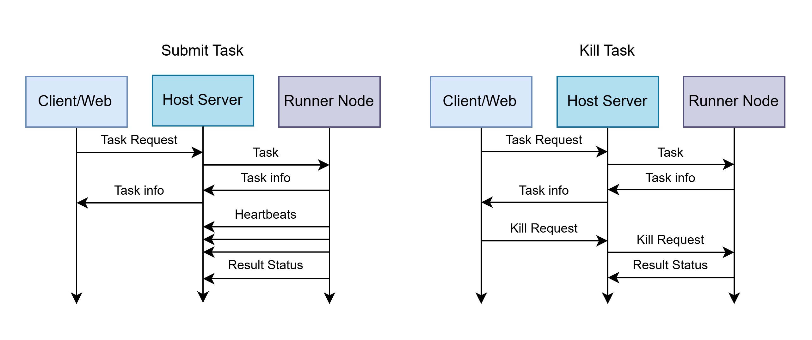

# Core Concepts

This document explains the fundamental concepts and design principles behind HakuRiver. Understanding these concepts will help you make the most of the system.

## Docker as a Portable Environment

### Traditional vs. HakuRiver Approach

In traditional container orchestration:
- Containers package application code, dependencies, and runtime together
- Each service runs in its own container with specific ports, networking, etc.
- Focus is on microservice architecture and production deployment

In HakuRiver:
- Containers serve as **portable virtual environments**
- The focus is on providing consistent execution environments for CLI tasks
- The same container image can be used for many different tasks
- Containers are automatically distributed and kept in sync

> **Key Insight**: Docker in HakuRiver functions more like a virtual environment (like Python's venv or conda) that can be dynamically adjusted and automatically synchronized across nodes.

## Host-Runner Architecture

HakuRiver uses a simple Host-Runner architecture:

### The Host
- Central coordinator for the entire cluster
- Manages Docker environments (creation, modification, packaging)
- Receives task submissions and distributes them to Runners
- Tracks node status, resources, and task lifecycle
- Provides WebSocket terminal access to containers
- Serves the web dashboard and API endpoints

### The Runners
- Execute tasks on compute nodes
- Automatically synchronize Docker environments from shared storage
- Report health metrics and resource usage to the Host
- Manage resource allocation (CPU/memory limits)
- Handle task execution within Docker or via systemd

### Communication Flow
1. Runners register with the Host at startup
2. Clients submit tasks to the Host
3. Host assigns tasks to appropriate Runners
4. Runners report task status updates back to the Host
5. Runners periodically send heartbeats with resource usage

## Container Workflow

HakuRiver introduces a unique workflow for managing Docker environments:

1. **Create and Customize**:
   - Create a persistent base container on the Host
   - Access an interactive shell to install software and dependencies
   - Customize the environment to your needs
   
2. **Package and Distribute**:
   - Commit the customized container to a tarball stored in shared storage
   - The tarball captures the complete environment with all installed software
   
3. **Automatic Synchronization**:
   - Runners automatically check for required container tarballs
   - If needed, they load the container image from the shared tarball
   - This ensures all nodes have the exact same environment

4. **Task Execution**:
   - Tasks run in temporary containers created from the synced image
   - Each task gets its own isolated environment
   - Resource limits and mounts are applied consistently

This approach combines the flexibility of interactive environment setup with the reproducibility and isolation of containers.

## Task Submission and Targeting

HakuRiver offers flexible task targeting options:

### Target Syntax
- `node1`: Target a specific node
- `node1:0`: Target NUMA node 0 on node1
- Multiple targets: Submit the same task to multiple nodes

### Execution Methods
- **Docker Mode**: Tasks run inside Docker containers with resource limits
- **Systemd Fallback**: Tasks can run directly on the node via systemd-run (when `--container NULL` is specified)

### Resource Allocation
- **CPU Cores**: Specify how many CPU cores a task requires
- **Memory Limits**: Set maximum memory usage for tasks
- **NUMA Binding**: Optionally bind tasks to specific NUMA nodes for locality

## Shared Storage and Mounting

Shared storage is a critical component of HakuRiver:

- **Container Tarballs**: Stored in shared storage for distribution
- **Task Logs**: Output and error logs written to shared storage
- **Shared Data**: Available to tasks via predictable mount points
- **Local Temp**: Each Runner has a local temporary directory for fast I/O

Every Docker container automatically gets these mount points:
- `/shared`: The shared directory accessible across nodes
- `/local_temp`: Node-specific fast storage for temporary files

## Task Lifecycle

Tasks in HakuRiver follow this lifecycle:

1. **Submission**: Client submits task to Host
2. **Pending**: Host receives and validates task
3. **Assigning**: Host assigns task to Runner(s)
4. **Running**: Runner executes task within container
5. **Completed/Failed**: Task finishes execution
6. **Killed/Lost**: Task terminated manually or due to node failure

The Host tracks all task states in its SQLite database, allowing you to query status, view logs, and manage running tasks.

## The `hakurun` Utility

HakuRiver includes a standalone utility called `hakurun` for parameter sweeps:

- **Purpose**: Test commands with multiple argument combinations
- **Usage**: Run locally before submitting to the cluster
- **Syntax**: Uses `span:{start..end}` and `span:[a,b,c]` for argument expansion
- **Execution**: Runs all combinations sequentially or in parallel
- **Important Note**: `hakurun` is a local utility that doesn't interact with the cluster

## Web Dashboard

The optional web dashboard provides a visual interface for:

- **Monitoring**: View node status, resource usage, and task status
- **Submission**: Submit tasks through a form interface
- **Management**: Kill, pause, or restart tasks
- **Logs**: View task output and error logs

## Next Steps

Now that you understand the core concepts of HakuRiver, you can:

- Follow the [Quick Start Guide](quick-start.md) to set up your cluster
- Read about the [Container Workflow](../user-guides/container-workflow.md) in detail
- Learn about [Task Submission](../user-guides/task-submission.md) options