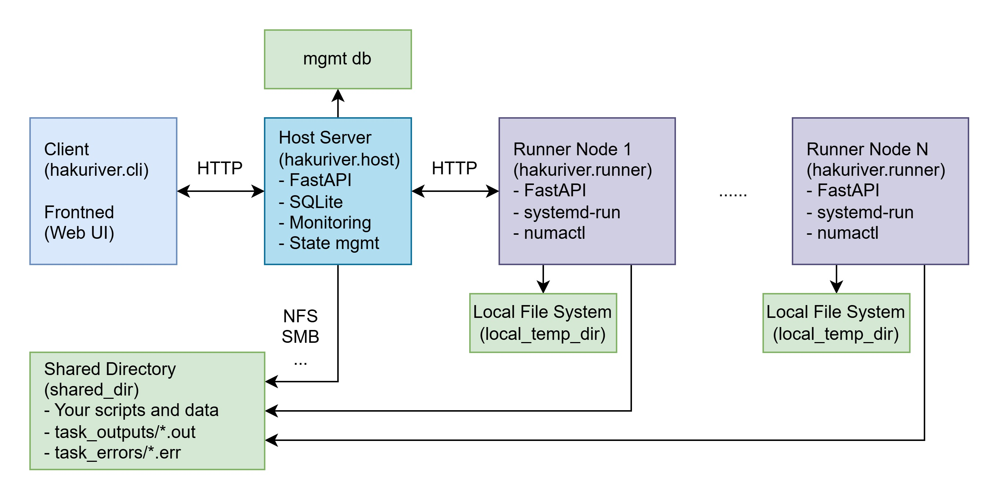
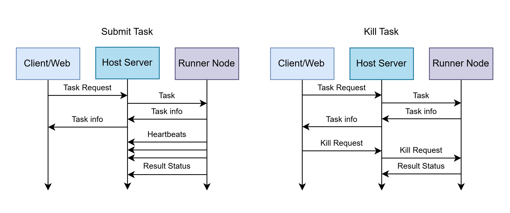

# Architecture Overview

HakuRiver employs a simple Host-Runner architecture designed for managing command-line tasks and VPS sessions across a small cluster of nodes, leveraging Docker for environment management and a shared filesystem for data distribution.

*Diagram showing Host, Runners, Clients, Shared Storage, and communication flow.*

## Components

1.  **Host (`hakuriver.host`)**
    *   **Role:** Central coordinator, API server, state manager.
    *   **Technology:** FastAPI (Python web framework), Peewee ORM, SQLite database, Python `docker` library (for Host-side management), Python `asyncio` for concurrent operations and networking.
    *   **Responsibilities:**
        *   **API Server:** Exposes HTTP endpoints (`/api/*`) for Runners and Clients (task submission, status checks, node registration, heartbeats, Docker management, log retrieval).
        *   **Node Management:** Tracks registered Runner nodes, their status (online/offline based on heartbeats), resource capacity (CPU cores, memory, **NUMA topology**, **GPU details** reported by Runners).
        *   **Task Scheduling & Dispatch:** Receives task requests (`POST /api/submit`). Validates targets and requested resources (cores, memory, **GPU IDs**). Selects suitable Runner(s) based on target specifications (hostname, optional NUMA ID, optional GPU IDs) and resource availability. Creates Task records in the SQLite DB. Asynchronously dispatches tasks to the assigned Runner(s) via the Runner's `/run` endpoint. Handles auto-selection of nodes if no target is specified for VPS tasks.
        *   **Task Tracking:** Stores all task details (ID, type, command, args, status, assigned node, resources, log paths, timestamps, container details, **SSH port** for VPS) in the SQLite database (`cluster_management.db`). Updates task status based on Runner reports (`POST /api/update`).
        *   **Docker Environment Management (Host-side):** Manages persistent Docker containers on the Host machine itself (`/api/docker/host/*`) using the Docker API. Provides WebSocket endpoint (`/api/docker/host/.../terminal`) for interactive shells into these containers (`hakuriver.docker-shell`). Orchestrates committing containers and saving images to versioned tarballs in shared storage (`/api/docker/create_tar/*`) using `docker commit` and `docker save`. Lists available tarballs (`/api/docker/list`).
        *   **SSH Proxy Server (Host-side):** Runs a custom TCP server on `[network] host_ssh_proxy_port`. Accepts connections from `hakuriver.ssh` clients. Based on the requested VPS Task ID, looks up the Runner's IP and the task's dynamic SSH port in the DB and establishes a connection, acting as a raw data proxy between the client and the VPS container's SSH daemon.
        *   **Background Tasks:** Runs background tasks using `asyncio` to check for and mark offline Runners based on heartbeat timeouts and perform other cleanup.
        *   **Web Dashboard (Optional):** Serves the static files for the frontend web application and provides the necessary API endpoints it consumes.

2.  **Runner (`hakuriver.runner`)**
    *   **Role:** Agent running on each compute node, responsible for executing tasks locally.
    *   **Technology:** FastAPI, Docker Engine (dependency), systemd (optional fallback), `numactl` (optional dependency), `pynvml` (optional dependency for GPU reporting).
    *   **Responsibilities:**
        *   **Registration:** Registers with the Host on startup (`POST /api/register`), reporting hostname, `runner_url`, total CPU cores, total memory, detected **NUMA topology** (via `numactl`), and **GPU details** (via `pynvml`).
        *   **Heartbeat:** Sends periodic heartbeats (`PUT /api/heartbeat/{hostname}`) to the Host, including current CPU/memory/GPU usage, temperatures, and lists of running/killed tasks.
        *   **Task Execution:**
            *   Receives task execution requests from the Host via its `/run` endpoint.
            *   **Docker Execution (Default):** Checks if the required Docker image (`hakuriver/<env_name>:base`) exists locally and is up-to-date compared to the latest tarball in `shared_dir/container_dir`. If needed, loads the latest tarball using `docker load`. Executes the task command (for Command tasks) or starts the SSH service (for VPS tasks) inside a Docker container (`docker run`). Applies resource limits (`--cpus`, `--memory`, `--gpus device=<ids>`), directory mounts (`shared_dir/shared_data` -> `/shared`, `local_temp_dir` -> `/local_temp`, plus additional mounts, and binds necessary system binaries/libraries like `numactl`), and other container options. For VPS tasks, configures SSH key injection and maps a dynamic host port to container port 22, reporting the assigned host port back to the Host.
            *   **Systemd Execution (Fallback for Command Tasks):** If the task requests `--container NULL`, it runs the command directly on the Runner host using `sudo systemd-run --scope --collect`. Applies resource limits (`CPUQuota`, `MemoryMax`), environment variables, working directory, and optionally NUMA binding using `numactl --cpunodebind --membind`. Redirects stdout/stderr to files in `shared_dir`.
        *   **Status Reporting:** Sends task status updates (`running`, `completed`, `failed`, `killed_oom`, `paused`, `resumed`) back to the Host's `/api/update` endpoint. Includes exit codes and error messages.
        *   **Task Control:** Handles kill/pause/resume requests from the Host (`POST /kill`, `/pause`, `/resume`) by interacting with `docker kill`/`pause`/`unpause` or `systemctl stop`/`kill -SIGSTOP`/`kill -SIGCONT` on the task's process or container.

3.  **Client (`hakuriver.client`, `hakuriver.task`, `hakuriver.vps`, `hakuriver.ssh`, `hakuriver.docker`, `hakuriver.docker-shell`)**
    *   **Role:** Command-line tools for user interaction.
    *   **Technology:** Python scripts using `httpx` (for HTTP requests) and `websockets` (for terminal), `asyncio` (for `hakuriver.ssh` proxy client).
    *   **Responsibilities:**
        *   `hakuriver.client`: General commands (list nodes, get health, check task status, kill/pause/resume any task by ID).
        *   `hakuriver.task`: Submit command tasks (`/api/submit`), get logs (`/api/task/.../stdout/stderr`).
        *   `hakuriver.vps`: Submit VPS tasks (`/api/submit`), list active VPS tasks (`/api/vps/status`).
        *   `hakuriver.ssh`: Connect to running VPS tasks via the Host's SSH proxy (`[network] host_ssh_proxy_port`).
        *   `hakuriver.docker`: Manage Host-side Docker environments and tarballs (`/api/docker/*`).
        *   `hakuriver.docker-shell`: Connects via WebSocket to the Host's terminal endpoint (`/api/docker/host/.../terminal`).

4.  **Frontend (Optional)**
    *   **Role:** Web-based user interface.
    *   **Technology:** Vue.js, Vite (build tool), Element Plus UI library.
    *   **Responsibilities:** Provides a graphical way to monitor node/GPU/task status, submit new Command and VPS tasks via forms (interacting with Host API endpoints like `/api/nodes`, `/api/health`, `/api/tasks`, `/api/vps/status`, `/api/submit`, `/api/docker/*`), view logs, and manage tasks visually. Requires a separate web server (or Vite dev server) and configured API/WebSocket proxying to the Host.

5.  **Database (SQLite)**
    *   **Role:** Persistent storage for cluster state, managed by the Host.
    *   **Technology:** SQLite file, accessed via Peewee ORM.
    *   **Schema:** Includes `Node` table (hostname, URL, resources, status, heartbeat, NUMA/GPU JSON) and `Task` table (task ID, type, batch ID, command/args/env JSON, status, assigned node, resources, log paths, timestamps, unit name, target NUMA, container/Docker info, SSH port).

6.  **Shared Storage**
    *   **Role:** **Mandatory** filesystem accessible by the Host and all Runners at a consistent logical path (configured via `[paths] shared_dir`).
    *   **Technology:** NFS, Samba, GlusterFS, CephFS, etc.
    *   **Responsibilities:**
        *   Stores HakuRiver container environment tarballs (`shared_dir/container_dir/`).
        *   Stores stdout (`shared_dir/task_outputs/`) and stderr (`shared_dir/task_errors/`) log files for Command tasks.
        *   Can be used for shared task input/output data (`shared_dir/shared_data/` mounted as `/shared` in Docker tasks).

## Communication Flow

*Diagram showing interactions between Client, Host, Runner, and Shared Storage.*

1.  **Runner Registration:** Runner starts -> Detects resources (CPU, Mem, NUMA, GPU) -> Sends info to Host `/api/register`. Host stores/updates Node in DB.
2.  **Runner Heartbeat:** Runner periodically -> Gathers current usage (CPU, Mem, GPU, Temp) and running/killed tasks -> Sends data to Host `/api/heartbeat/{hostname}`. Host updates Node status/metrics in DB. Host background task checks for timed-out heartbeats.
3.  **Task Submission:** Client (CLI or Web) -> User requests task execution -> Client forms `TaskRequest` payload -> Sends to Host `/api/submit`.
4.  **Task Assignment:** Host -> Validates `TaskRequest`, selects Runner(s) based on targets/resources -> Creates Task record(s) in DB (status 'assigning') -> Sends `TaskInfo` payload to Runner `/run` endpoint.
5.  **Task Execution Start:** Runner -> Receives `TaskInfo` -> (If Docker) Checks/syncs image from Shared Storage (`docker load` from tar) -> Starts execution (Docker container via `docker run` or Systemd scope via `systemd-run`) -> (For VPS) Gets assigned SSH port from Docker -> Reports 'running' status (and SSH port for VPS) to Host `/api/update`. Task record updated in DB.
6.  **Task Progress/Completion:** Runner -> Task runs -> Writes logs to Shared Storage (Command tasks) -> Task finishes (success/fail) or state changes (pause/resume) -> Reports final or intermediate status to Host `/api/update`. Task record updated in DB.
7.  **Status/Info Query:** Client -> Requests cluster info (`/api/nodes`, `/api/health`), task list (`/api/tasks`, `/api/vps/status`), or specific task status (`/api/status/{task_id}`) -> Host retrieves data from DB -> Sends back to Client.
8.  **Log Retrieval (Command Tasks):** Client -> Requests logs (`/api/task/{task_id}/stdout/stderr`) -> Host reads file from Shared Storage -> Sends back to Client.
9.  **Task Control:** Client -> Sends kill/command request (`/api/kill/{task_id}`, `/api/command/{task_id}/{action}`) -> Host updates DB status -> Sends control request (`/kill`, `/pause`, `/resume`) to Runner API. Runner handles the signal (e.g., `docker kill/pause/unpause`, `systemctl stop/kill`).
10. **Docker Management (Host-side):** Client (`hakuriver.docker` or Web) -> Sends request (`/api/docker/*`) -> Host interacts with its local Docker daemon or Shared Storage.
11. **Interactive Shell (Host-side):** Client (`hakuriver.docker-shell` or Web) -> Establishes WebSocket connection to Host `/api/docker/host/.../terminal` -> Host uses Docker Exec API to open shell and relays I/O.
12. **SSH Access (VPS Tasks):** Client (`hakuriver.ssh`) -> Connects to Host SSH proxy (`host_ssh_proxy_port`) -> Sends Task ID -> Host looks up Runner URL/VPS SSH port in DB -> Host connects to Runner/VPS port -> Host proxies raw SSH data bidirectionally. Authentication happens directly between Client's `ssh` and container's `sshd`.

## Key Design Points

*   **Simplicity:** Prioritizes ease of setup and use over complex features like resource-aware scheduling across multiple nodes (relies more on explicit targeting) or sophisticated workflow management.
*   **Docker as Environment:** Core concept is using Docker tarballs as portable, versioned environments automatically synced to Runners.
*   **Systemd Fallback:** Provides an alternative execution method for Command tasks when Docker isn't preferred or needed.
*   **Centralized State:** The Host maintains the single source of truth in its database. Runners are stateless regarding tasks between restarts (except for ongoing processes/containers).
*   **Shared Storage Dependency:** Relies heavily on shared storage for environment distribution and task logs/data. This is a mandatory component.
*   **GPU and NUMA Integration:** Basic support for requesting and allocating specific GPUs (Docker/VPS) and binding to NUMA nodes (Systemd) reported by Runners.
*   **SSH Proxy:** Simplifies access to interactive VPS tasks by providing a single Host entry point.
*   **Minimal Authentication:** Assumes a trusted internal network environment by default, requiring external security measures for exposure.